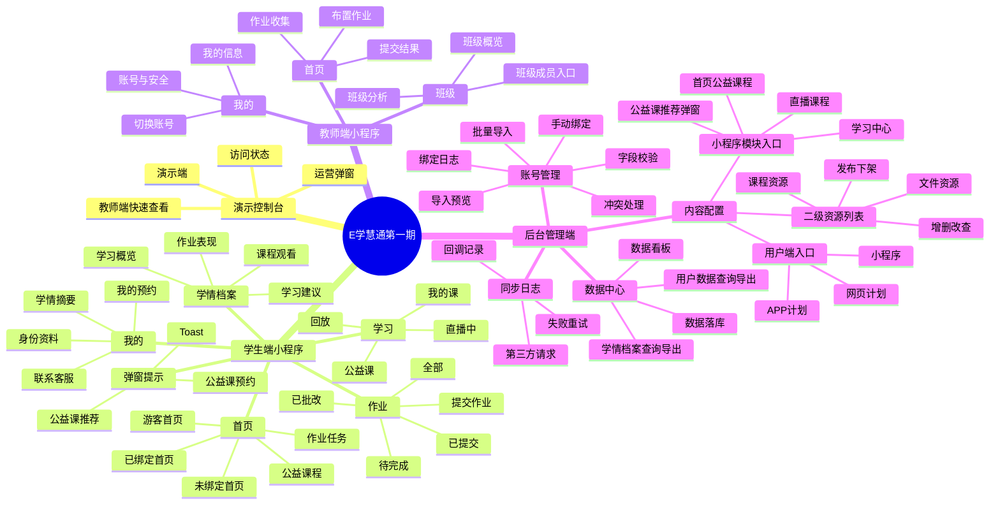
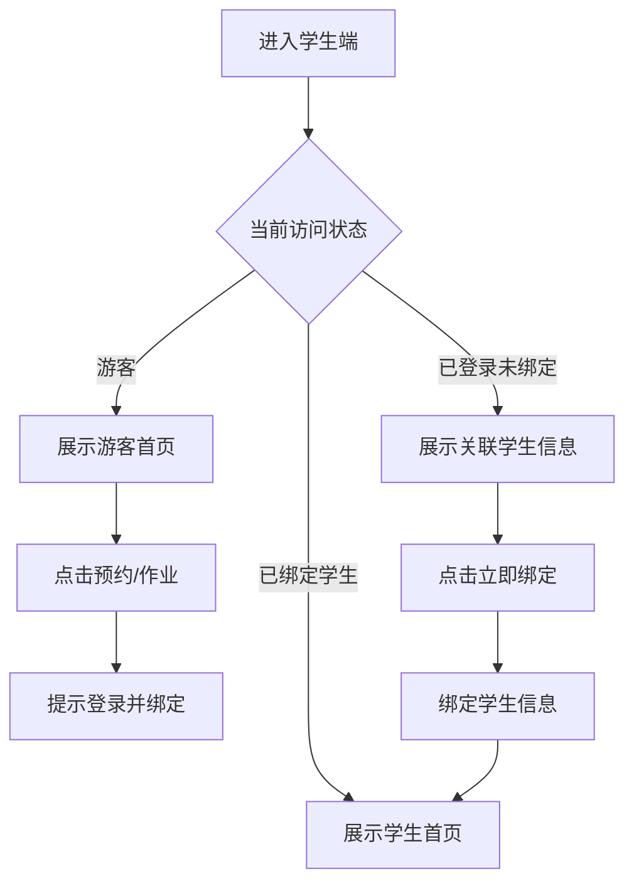
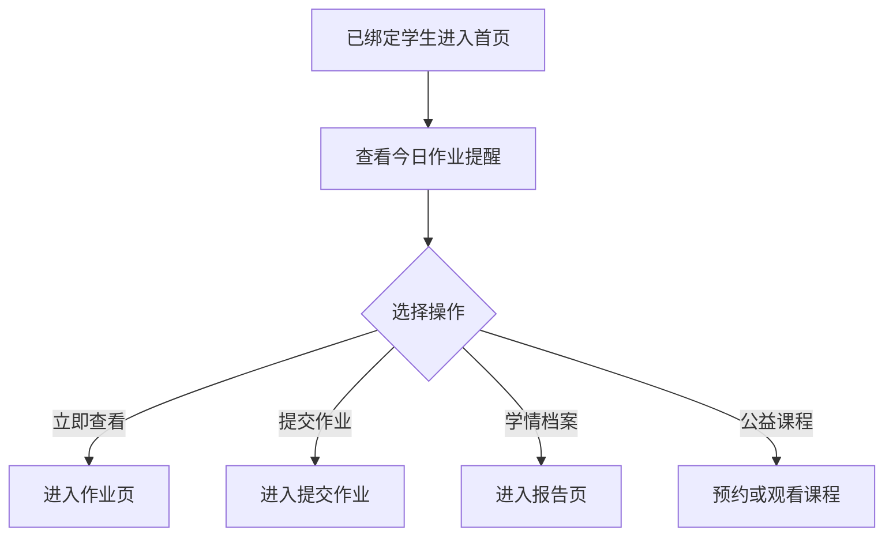
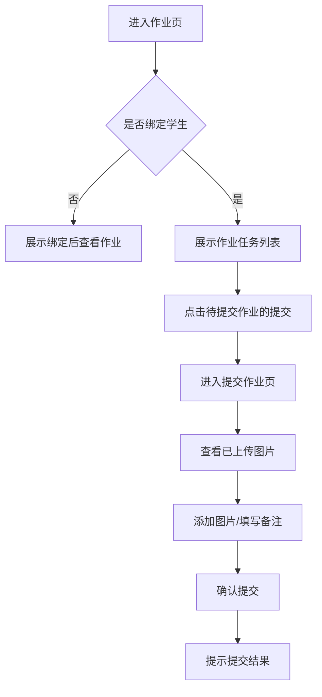
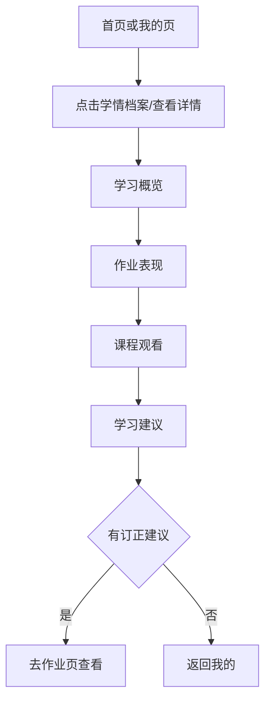
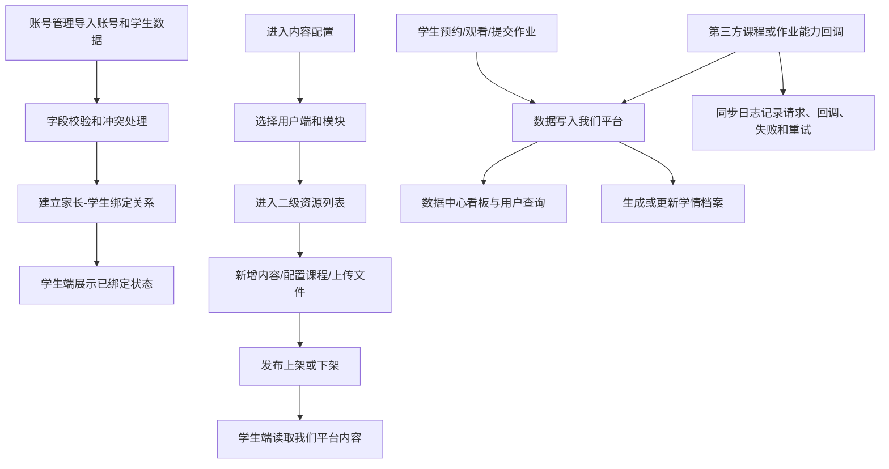

# E学慧通第一期小程序与后台端 PRD

## 1. 文档信息

| 字段 | 内容 |
| --- | --- |
| 产品名称 | E学慧通第一期小程序与后台端 |
| 产品形态 | 微信小程序学生/家长端 + 教师端基础入口 + 内部后台管理端 |
| 文档版本 | V1.3 |
| 编写日期 | 2026-06-10 |
| 本版依据 | 以 `prototype.html`、`admin_prototype.html` 当前交互原型为第一期产品定位和页面范围依据，并参考 `e 学慧通小程序.rp` 中 V0.1.0 的学生端/教师端结构 |
| 参考说明 | 项目路线图存在阶段划分偏差，仅作为业务背景，不作为本 PRD 的一期范围判断依据 |

## 2. 产品定位

### 2.1 一句话定位

E学慧通第一期，是面向学生、家长和教师的小程序学习服务入口，加上内部后台管理端共同构成的学习服务闭环。学生端围绕“登录绑定、课程预约观看、作业提交、批改报告、学情档案”完成用户体验；教师端保留首页、班级、我的基础入口；后台端负责账号管理、内容配置、数据中心和同步日志，确保内容、账号、学习行为和第三方能力数据都沉淀在我们平台。

### 2.2 产品目标

| 目标 | 说明 | 原型依据 |
| --- | --- | --- |
| 建立小程序双端原型 | 学生端和教师端在同一手机预览中切换，便于评审 V0.1.0 双端结构 | `prototype.html` 演示端 |
| 完成访问状态分层 | 支持已绑定学生、已登录未绑定、游客三种状态 | 左侧“访问状态” |
| 跑通学习服务首页 | 首页展示学生身份、作业待办、提交作业、学情档案、公益课程 | `page-home` |
| 跑通学习/课程服务 | 学习页展示公益课、我的课、直播中、回放，并支持预约/观看 | `page-learning` |
| 跑通作业提交 | 展示作业任务，支持进入提交作业、添加图片、填写备注、确认提交 | `page-homework` |
| 跑通学情查看 | 展示作业正确率、提交次数、课程学习、作业表现、课程观看、学习建议 | `page-profile`、`page-report` |
| 保留运营触达 | 支持公益课预约弹窗和推荐弹窗 | `promoModal`、`promoAdModal` |
| 跑通教师端基础入口 | 支持教师端首页、班级、我的切换和基础操作反馈 | `page-teacher-home`、`page-teacher-class`、`page-teacher-profile` |
| 建立后台运营底座 | 账号管理、内容配置、数据中心、同步日志四个后台模块支撑学生端和教师端使用 | `admin_prototype.html` |

### 2.3 目标用户

| 用户类型 | 用户画像 | 核心诉求 |
| --- | --- | --- |
| 已绑定学生/家长 | 已完成学生信息绑定，可看到班级、作业和学习数据 | 快速提交作业、查看报告、预约/观看课程 |
| 已登录未绑定用户 | 已授权微信/手机号，但尚未关联学生信息 | 绑定学生后查看班级作业和学情 |
| 游客 | 未登录进入小程序的用户 | 先了解课程，登录后预约 |
| 运营/教务 | 负责公益课、作业、学习服务运营 | 推动课程预约、作业完成和报告查看 |
| 老师/服务人员 | 关注学生作业完成与学习表现的人 | 让学生/家长按任务完成提交和订正 |
| 后台管理员 | 负责账号管理、内容配置、数据中心、同步日志和数据核查 | 确保小程序数据可用且全部落在我们平台 |
| 研发/技术支持 | 负责第三方接口配置、同步日志和异常排查 | 保证第三方只提供功能，我们平台掌握主数据 |

## 3. 一期范围

### 3.1 本期包含

- 学生端原型独立呈现：左侧演示控制台 + 手机小程序预览。
- 访问状态：已绑定学生、已登录未绑定、游客。
- 首页：身份卡、作业待办、提交作业、学情档案、作业任务、公益课程。
- 学习：公益课、我的课、直播中、回放；课程预约和观看。
- 作业：待完成、已提交、已批改、全部；作业列表、提交作业、图片上传、备注、确认提交。
- 我的：个人身份、未绑定提示、学情摘要、看课手机号、我的预约、联系客服。
- 学情档案：学习概览、作业表现、课程观看、学习建议。
- 运营弹窗：公益课预约弹窗、公益课推荐弹窗。
- Toast 和基础交互反馈。
- 教师端：教师首页、班级、我的三个基础页面，以及布置作业、查看提交结果、班级分析等入口级交互反馈。
- 后台端：仅保留账号管理、内容配置、数据中心、同步日志四个一级模块。
- 账号管理：整合账号导入、用户检索、学生绑定和冲突处理。
- 内容配置：按用户端和模块组织，一级页展示小程序/网页计划/APP计划及模块入口，二级资源列表完成新增、编辑、删除、课程资源配置、文件上传、发布上架和下架。
- 数据中心：提供数据看板、用户数据查询与导出、学情档案单用户查询与导出，并将原数据落库设计下沉为子模块。
- 同步日志：展示第三方请求、回调、失败、重试和配置缺失等问题。

### 3.2 本期不展开

以下内容未在当前 `prototype.html` 与 `admin_prototype.html` 中直接表达，不纳入本 PRD 的一期主范围：

- 商城、支付、价格、优惠、购物车。
- 销售企微侧边栏。
- 老板端数据大盘。
- 教师端复杂教学管理细节，如完整作业批改、课表、消息、班级成员深度管理。

> 注意：作业提交、批改报告、学情档案已经在当前原型中清晰呈现，不应再被划到后续版本。

## 4. 产品架构

### 4.1 页面结构

### 4.2 用户状态与权限

| 状态 | 首页 | 学习 | 作业 | 我的/学情 |
| --- | --- | --- | --- | --- |
| 游客 | 展示“登录后可预约课程” | 可浏览课程，关键动作需登录 | 不可查看，提示登录绑定 | 不展示学生数据 |
| 已登录未绑定 | 展示微信用户和手机号，提示绑定 | 可预约前引导绑定 | 展示“绑定后查看作业” | 展示“还未绑定学生” |
| 已绑定学生 | 展示学生身份、作业和课程 | 可预约/观看 | 可看任务、提交、查看报告 | 可看学情摘要和详情 |

### 4.3 系统集成原则

| 原则 | 说明 |
| --- | --- |
| 小程序只对接我们平台 | 学生端登录、课程、作业、报告接口均请求我们自己的后端服务 |
| 第三方只提供功能 | 作业批改、课程播放/观看能力由第三方提供，但不作为主业务系统 |
| 数据全部落在我们平台 | 账号、绑定、内容配置、预约、观看、作业提交、批改结果、学情报告都写入我们数据库 |
| 后台端提供配置入口 | 展示内容、第三方课程资源、作业能力同步策略、回调地址、重试规则均通过后台配置或监控 |
| 第三方异常可追踪 | 所有外部请求、回调、同步失败和重试都进入同步日志 |

## 5. 核心流程

### 5.1 访问状态切换流程

### 5.2 首页学习服务流程

### 5.3 作业提交流程

### 5.4 学情档案查看流程

### 5.5 后台端账号、内容与数据流

## 6. 详细功能说明

### 6.1 访问状态与绑定

| 字段 | 说明 |
| --- | --- |
| 功能编号 | A-01 |
| 功能名称 | 访问状态与学生绑定 |
| 优先级 | P0 |
| 页面位置 | 左侧控制台、首页、作业页、我的页 |

**页面元素**

| 元素 | 类型 | 说明 |
| --- | --- | --- |
| 已绑定学生 | 状态按钮 | 切换后展示完整学习服务 |
| 已登录未绑定 | 状态按钮 | 展示手机号和绑定引导 |
| 游客 | 状态按钮 | 展示登录后预约课程的提示 |
| 立即绑定/去绑定 | 按钮 | 进入学生绑定流程 |
| Toast | 反馈 | 未登录或未绑定访问受限功能时提示 |

**交互要求**

1. 切换“已绑定学生”后：首页展示学生身份、作业提醒、作业任务和公益课程。
2. 切换“已登录未绑定”后：首页展示微信用户和手机号，作业页展示绑定拦截，我的页展示未绑定提示。
3. 切换“游客”后：首页展示“登录后可预约课程”，访问作业时提示登录并绑定。
4. 绑定成功后应自动进入已绑定状态。

### 6.2 首页

| 字段 | 说明 |
| --- | --- |
| 功能编号 | H-01 |
| 功能名称 | 首页学习服务台 |
| 优先级 | P0 |
| 页面位置 | `page-home` |

**页面元素**

| 元素 | 说明 |
| --- | --- |
| 学生身份卡 | 头像、姓名、年级班级、学习账号 |
| 今日作业提醒 | “今日有 2项作业 待完成”及“立即查看” |
| 提交作业快捷卡 | 跳转提交作业页 |
| 学情档案快捷卡 | 跳转学情档案页 |
| 作业任务列表 | 展示英语、数学等作业任务和状态 |
| 公益课程列表 | 展示课程名称、时间、预约/观看按钮 |
| 未绑定引导 | 关联学生信息卡片 |
| 游客引导 | 登录后可预约课程空状态 |

**交互要求**

1. 点击“立即查看”和“全部作业”进入作业页。
2. 点击“提交作业”直接进入作业提交视图。
3. 点击“学情档案”进入报告页。
4. 点击“更多课程”进入学习页。
5. 首页必须根据访问状态显示不同内容。

### 6.3 学习/课程

| 字段 | 说明 |
| --- | --- |
| 功能编号 | C-01 |
| 功能名称 | 学习页与课程内容 |
| 优先级 | P0 |
| 页面位置 | `page-learning` |

**页面元素**

| 元素 | 说明 |
| --- | --- |
| Tab | 公益课、我的课、直播中、回放 |
| 课程卡片 | 课程标题、适用年级或开课时间 |
| 立即预约 | 触发公益课预约弹窗 |
| 去观看 | 触发观看反馈或进入观看流程 |

**交互要求**

1. 默认展示公益课。
2. “立即预约”展示预约成功提示，并说明关注服务号接收开课提醒。
3. “去观看”进入观看动作反馈。
4. 公益课推荐弹窗可从左侧运营弹窗按钮触发。

### 6.4 作业

| 字段 | 说明 |
| --- | --- |
| 功能编号 | W-01 |
| 功能名称 | 作业任务与提交 |
| 优先级 | P0 |
| 页面位置 | `page-homework` |

**页面元素**

| 元素 | 说明 |
| --- | --- |
| Tab | 待完成、已提交、已批改、全部 |
| 绑定拦截卡 | 未绑定时提示“绑定后查看作业” |
| 作业列表 | 英语待提交、语文已批改等任务 |
| 提交按钮 | 进入提交作业表单 |
| 报告按钮 | 进入学情档案/批改报告 |
| 上传区域 | 第1页、第2页、添加 |
| 备注输入框 | 作业备注 |
| 确认提交 | 提交作业 |

**交互要求**

1. 未绑定时不展示作业列表，展示绑定说明。
2. 已绑定时展示作业列表。
3. 点击待提交作业的“提交”后展示提交作业表单。
4. 点击已批改作业的“报告”进入报告页。
5. 点击“确认提交”后给出提交成功或提交中反馈。

**异常处理**

| 场景 | 处理 |
| --- | --- |
| 未绑定访问作业 | 展示绑定卡片和 Toast |
| 图片上传失败 | 保留已上传图片，提示重新添加 |
| 重复点击确认提交 | 按钮进入提交中，避免重复提交 |
| 备注为空 | 可提交，备注非必填 |

### 6.5 我的

| 字段 | 说明 |
| --- | --- |
| 功能编号 | P-01 |
| 功能名称 | 我的与学情摘要 |
| 优先级 | P0 |
| 页面位置 | `page-profile` |

**页面元素**

| 元素 | 说明 |
| --- | --- |
| 个人身份卡 | 头像、姓名、年级班级、学习账号 |
| 未绑定提示 | 绑定后可查看作业任务、批改报告和学情档案 |
| 学情档案摘要 | 作业正确率、提交次数、课程学习 |
| 学科进度 | 英语、数学、语文表现 |
| 看课手机号 | 手机号脱敏展示 |
| 我的预约 | 展示预约课程数 |
| 联系客服 | 客服入口 |

**交互要求**

1. 已绑定时展示学情摘要。
2. 未绑定时隐藏学情摘要并展示绑定提示。
3. 点击“查看详情”进入报告页。
4. 点击“联系客服”进入客服动作反馈。

### 6.6 学情档案/报告

| 字段 | 说明 |
| --- | --- |
| 功能编号 | R-01 |
| 功能名称 | 学情档案详情 |
| 优先级 | P0 |
| 页面位置 | `page-report` |

**页面元素**

| 模块 | 说明 |
| --- | --- |
| 学习概览 | 作业正确率、提交次数、按时提交率、已看课程、课程学习、最近学习 |
| 作业表现 | 英语、数学、语文进度条 |
| 订正提醒 | 提示还有 1 项订正并可去查看 |
| 课程观看 | 高三冲刺规划公开课、最近学习、学习进度 |
| 同步说明 | 课程学习数据可能存在数分钟延迟，具体以小鹅通同步结果为准 |
| 学习建议 | 优先完成待提交作业、保持数学节奏、继续观看公开课 |

**交互要求**

1. “返回我的”回到我的页。
2. “去查看”跳转作业页。
3. 学习建议为规则生成，不需要在本期做复杂 AI 解释。
4. 课程数据存在延迟时必须展示说明。

### 6.7 运营弹窗

| 字段 | 说明 |
| --- | --- |
| 功能编号 | O-01 |
| 功能名称 | 公益课预约与推荐弹窗 |
| 优先级 | P1 |
| 页面位置 | `promoModal`、`promoAdModal` |

**页面元素**

| 元素 | 说明 |
| --- | --- |
| 公益课预约弹窗 | 提示预约成功后关注服务号接收开课提醒 |
| 公益课推荐弹窗 | 展示课程名称、时间、课程卡片、预约和观看按钮 |
| 稍后再说/关闭 | 关闭弹窗 |
| 立即预约/去观看 | 执行运营动作 |

**交互要求**

1. 弹窗必须可关闭。
2. 推荐弹窗触发时机后续可由运营策略决定，但原型需保留触发效果。
3. 弹窗内课程信息与课程列表保持一致。

### 6.8 教师端基础入口

| 字段 | 说明 |
| --- | --- |
| 功能编号 | T-01 |
| 功能名称 | 教师端首页、班级与我的 |
| 优先级 | P1 |
| 页面位置 | `page-teacher-home`、`page-teacher-class`、`page-teacher-profile` |

**页面元素**

| 元素 | 说明 |
| --- | --- |
| 演示端切换 | 左侧“学生端 / 教师端”切换按钮 |
| 教师端快速查看 | 仅教师端展示“首页 / 班级 / 我的”快速入口 |
| 教师端底部导航 | 首页、班级、我的 |
| 教师首页 | 布置作业、提交结果、作业收集等入口级卡片 |
| 班级页 | 班级概览、班级分析、成员入口 |
| 我的页 | 我的信息、账号与安全、关于我们、切换账号 |

**交互要求**

1. 切换到教师端后，学生端访问状态控件和运营弹窗控件隐藏，教师端快速查看展示。
2. 教师端底部导航可在首页、班级、我的之间切换。
3. 教师端入口级按钮需给出 Toast 或页面反馈，保证评审可点击。
4. 本期仅覆盖教师端基础入口和页面结构，不展开完整教学管理后台。

### 6.9 后台账号管理

| 字段 | 说明 |
| --- | --- |
| 功能编号 | B-A-01 |
| 功能名称 | 账号导入与学生绑定 |
| 优先级 | P0 |
| 页面位置 | 后台端：账号管理 |

**页面元素**

| 元素 | 说明 |
| --- | --- |
| 导入模板下载 | 提供标准 Excel/CSV 模板 |
| 文件上传 | 上传学生和家长账号数据 |
| 字段映射 | 映射手机号、学生姓名、学校、年级、班级、学习账号 |
| 导入预览 | 展示新增、更新、冲突、错误数据 |
| 错误明细 | 展示错误行、错误字段和处理建议 |
| 绑定列表 | 按手机号、学生姓名、学习账号查询绑定关系 |
| 手动绑定 | 为已登录未绑定用户建立学生关系 |
| 冲突处理 | 处理一个手机号多个学生、一个学生多个手机号等情况 |

**交互要求**

1. 运营上传导入文件后，系统先校验，不直接入库。
2. 校验通过或人工确认冲突后，才允许确认导入。
3. 小程序端用户授权手机号后，后端根据后台绑定关系返回学生信息。
4. 所有导入、绑定、解绑、修改都记录操作日志。

### 6.10 后台内容配置

| 字段 | 说明 |
| --- | --- |
| 功能编号 | B-C-01 |
| 功能名称 | 多用户端内容配置 |
| 优先级 | P0 |
| 页面位置 | 后台端：内容配置 |

**页面元素**

| 元素 | 说明 |
| --- | --- |
| 用户端入口 | 小程序、网页（计划）、APP（计划）；当前仅实现小程序 |
| 小程序模块入口 | 首页公益课程、学习中心、直播课程、公益课推荐弹窗 |
| 二级资源列表 | 点击模块后展示该模块下属资源内容列表 |
| 新增内容 | 在当前模块下创建内容标题、按钮文案、排序和展示规则 |
| 课程资源 | 上传自有视频课程，或关联第三方课程 |
| 第三方课程同步 | 如小鹅通，通过接口获取封面、名称、详情、课节等课程信息 |
| 文件资源 | 支持 PDF、WORD、PPT 等文件，非必传 |
| 关联关系 | 课程和文件可以关联，也可以单独存在 |
| 发布状态 | 支持发布上架、下架，并保留历史预约、观看和配置记录 |

**交互要求**

1. 内容配置一级页面只展示用户端和模块，不平铺创建、上传、发布等操作。
2. 点击某个小程序模块后，进入二级资源列表。
3. 所有新增、编辑、删除、课程资源配置、文件上传、发布上架和下架均在二级资源列表或二级配置路径中完成。
4. 学生端不直接读取第三方课程资源配置，只读取我们平台内容/课程接口。
5. 后台关联第三方课程后，需生成或更新我们平台内容资源记录。
6. 观看进度由后端同步或回调写入我们平台，再展示到学情档案。
7. 内容下架后，学生端不再展示，但历史预约、观看和学习数据保留。

### 6.11 后台第三方作业能力与同步支撑

| 字段 | 说明 |
| --- | --- |
| 功能编号 | B-W-01 |
| 功能名称 | 第三方作业服务接入 |
| 优先级 | P0 |
| 页面位置 | 后台端：同步日志、数据中心 |

**页面元素**

| 元素 | 说明 |
| --- | --- |
| 作业服务商配置 | API 地址、鉴权密钥、回调地址、启停状态 |
| 接口能力开关 | 作业上传、批改、报告回传、重试 |
| 作业任务映射 | 第三方作业 ID、我们平台作业 ID、科目、截止时间 |
| 提交记录 | 学生、作业、图片数、备注、提交状态 |
| 批改结果 | 分数、状态、报告、回调时间 |
| 接口日志 | 请求、响应、回调、失败原因、耗时 |

**交互要求**

1. 学生端提交作业时，只上传到我们平台。
2. 我们后端将图片和备注转发给第三方作业能力。
3. 第三方完成批改后，通过回调或同步接口把结果返回我们平台。
4. 我们平台落库后，学生端报告页读取我们平台数据。
5. 第三方失败时，后台支持重试、人工补偿和失败标记。

### 6.12 后台数据中心与同步日志

| 字段 | 说明 |
| --- | --- |
| 功能编号 | B-D-01 |
| 功能名称 | 数据统一落库与同步监控 |
| 优先级 | P0 |
| 页面位置 | 后台端：数据中心、同步日志 |

**页面元素**

| 元素 | 说明 |
| --- | --- |
| 数据看板 | 总用户、今日学习人数、总观看时长、学情档案数量等关键指标 |
| 用户数据查询 | 支持姓名/用户名、手机号、微信号、微信昵称、地区、学校、年级、学习课程、观看时长、最近学习时间 |
| 用户数据导出 | 按当前筛选条件导出用户学习数据 |
| 学情档案查询与导出 | 支持单用户查看和导出学情档案 |
| 数据落库子模块 | 原数据落库状态下沉为数据中心的核查子模块，展示课程、作业、批改、报告写入状态 |
| 同步日志 | 课程同步、作业提交、批改回调、数据入库 |
| 异常筛选 | 按服务商、接口、状态、时间筛选 |
| 重试按钮 | 对失败任务发起重试 |

**交互要求**

1. 第三方只作为能力服务，所有最终业务结果以我们平台数据库为准。
2. 同步日志需要能定位到学生、课程、作业、第三方请求 ID。
3. 报告生成依赖作业批改结果和课程观看数据，生成后写入学情报告表。
4. 数据中心需支持用户数据和学情档案导出，且导出字段与查询字段保持一致。

### 6.13 后台权限

| 角色 | 权限 |
| --- | --- |
| 超级管理员 | 全部模块配置、导入、修改、重试、权限管理 |
| 运营/教务 | 账号导入、学生绑定、内容配置、弹窗配置、数据查看 |
| 技术支持 | 第三方接口配置、同步日志、失败重试 |
| 只读人员 | 查看数据和日志，不可修改配置 |

## 7. 数据需求

### 7.1 核心数据对象

| 对象 | 字段示例 | 用途 |
| --- | --- | --- |
| 用户 | user_id、openid、phone、role_status | 判断游客、未绑定、已绑定 |
| 学生 | student_id、name、grade_class、learning_account | 首页和我的页身份展示 |
| 内容资源 | content_id、client_type、module_key、title、button_text、sort、publish_status | 后台内容配置和小程序展示 |
| 课程资源 | course_resource_id、source_type、provider_id、external_course_id、cover、title、detail、lesson_count | 自有视频课程或第三方课程 |
| 文件资源 | file_id、file_type、file_name、url、size、status | PDF、WORD、PPT 等资料 |
| 内容关联 | content_id、course_resource_id、file_id、relation_status | 课程和文件可关联，也可独立存在 |
| 课程 | course_id、title、type、start_time、status | 首页和学习页展示 |
| 预约 | reservation_id、student_id、course_id、status | 我的预约和提醒 |
| 作业 | homework_id、subject、title、teacher、assign_time、deadline、status | 首页和作业页 |
| 作业提交 | submit_id、homework_id、images、remark、submit_status、submitted_at | 提交作业 |
| 学情报告 | student_id、accuracy、submit_count、on_time_rate、subject_metrics、course_metrics、suggestions | 我的页和报告页 |
| 第三方服务商 | provider_id、type、name、api_base、auth_type、status | 配置课程/作业能力 |
| 课程映射 | course_resource_id、provider_id、external_course_id、sync_status | 第三方课程和我们课程资源的关系 |
| 作业映射 | homework_id、provider_id、external_homework_id、callback_status | 第三方作业和我们作业的关系 |
| 用户学习数据 | user_id、student_id、name、phone、wechat_id、wechat_nickname、region、school、grade、learning_course、watch_duration、last_learning_at | 数据中心查询与导出 |
| 同步日志 | log_id、provider_id、biz_type、biz_id、request_id、status、error_msg、retry_count | 排查第三方接口和数据入库问题 |

### 7.2 埋点事件

| 事件 | 触发时机 | 属性 |
| --- | --- | --- |
| `mini_program_page_view` | 页面切换 | page、role_status、client_type |
| `role_status_change` | 演示状态切换 | from_status、to_status |
| `client_mode_change` | 学生端/教师端切换 | from_client、to_client |
| `bind_click` | 点击立即绑定/去绑定 | page |
| `course_reserve_click` | 点击立即预约 | course_id、page |
| `course_watch_click` | 点击去观看 | course_id、page |
| `homework_submit_entry` | 点击提交作业 | homework_id、source |
| `homework_submit_confirm` | 点击确认提交 | homework_id、image_count、has_remark |
| `report_view` | 进入学情档案 | source |
| `promo_popup_open` | 触发公益课推荐弹窗 | trigger_source |
| `admin_content_module_open` | 后台进入内容配置二级模块 | client_type、module_key |
| `admin_content_publish_change` | 后台发布上架或下架 | content_id、module_key、publish_status |
| `toast_show` | 展示 Toast | message_type |

## 8. 非功能需求

### 8.1 性能

| 指标 | 要求 |
| --- | --- |
| 小程序首页首屏 | 常规网络下 2.5 秒内可交互 |
| 作业列表加载 | 1 秒内返回列表或空状态 |
| 提交作业 | 图片上传有进度或提交中状态 |
| 报告页加载 | 1.5 秒内展示概览数据 |
| 后台导入校验 | 1 万行以内 30 秒内完成校验并给出预览 |
| 第三方接口日志 | 请求完成后 5 秒内可在后台检索 |

### 8.2 安全与隐私

- 手机号脱敏展示，如原型中 `176****0909`。
- 学生作业和学情数据必须绑定后查看。
- 作业图片属于学习资料，上传、访问、存储需做权限校验。
- 联系客服时不得在前端暴露敏感身份标识。
- 第三方鉴权密钥只能加密存储，不在页面明文展示。
- 后台导入、绑定、配置修改、重试操作必须记录操作人和时间。

### 8.3 兼容与体验

- 支持主流微信小程序手机屏幕。
- 底部导航、课程按钮、提交按钮触控区域不低于 44px。
- 弹窗不遮挡关闭操作。
- 列表为空、未绑定、游客态均需有明确提示。

## 9. 验收标准

| 验收项 | 标准 |
| --- | --- |
| 状态切换 | 已绑定、未绑定、游客三种状态展示与当前原型一致 |
| 首页 | 已绑定首页包含身份卡、作业提醒、提交作业、学情档案、作业任务、公益课程 |
| 未绑定首页 | 展示手机号和关联学生信息入口 |
| 游客首页 | 展示登录后可预约课程提示 |
| 学习页 | 展示 4 个 Tab 和 3 张课程卡片，预约/观看按钮可交互 |
| 作业页 | 展示 4 个 Tab、绑定拦截、作业列表、提交作业表单 |
| 提交作业 | 展示已上传页、添加入口、备注输入和确认提交 |
| 我的页 | 展示身份、学情摘要、手机号、我的预约、联系客服 |
| 报告页 | 展示学习概览、作业表现、课程观看、学习建议 |
| 弹窗 | 公益课预约弹窗和推荐弹窗可触发、可关闭 |
| 提示 | 未登录/未绑定限制动作有 Toast |
| 教师端 | 可切换教师端，并在首页、班级、我的之间点击切换 |
| 后台账号管理 | 可上传账号文件、校验字段、预览结果、确认导入，并查询/处理学生绑定 |
| 后台内容配置一级页 | 只展示用户端和模块入口，不平铺创建、上传、发布等操作 |
| 后台内容配置二级页 | 点击模块后进入资源列表，并支持新增、编辑、删除、课程资源配置、文件上传、发布上架和下架 |
| 数据中心 | 展示数据看板，支持用户数据查询导出和学情档案单用户查询导出 |
| 数据落库子模块 | 课程、作业、批改、报告数据以我们平台数据库为准，并在数据中心核查 |
| 同步日志 | 可查看第三方请求、回调、失败原因并执行重试 |

## 10. 质量检查报告

### 技术风险

1. 作业图片上传和提交需防重复提交，并处理弱网失败。
2. 学情报告依赖作业与课程数据同步，需要明确数据延迟提示。
3. 未绑定拦截必须在前后端同时校验，不能只靠前端隐藏。
4. 小程序不能直连第三方，否则会造成数据不可控和鉴权泄露风险。
5. 第三方接口失败需要后台日志、重试和人工补偿机制。

### 用户体验

1. 首页的“提交作业”和“学情档案”是第一期核心入口，需要保持首屏可见。
2. 未绑定用户的下一步必须明确，绑定入口在首页、作业、我的均要出现。
3. 课程预约成功后的服务号提醒说明必须保留，避免用户错过开课。

### 运营需求

1. 公益课推荐弹窗需要支持触发时机配置，但首期原型先保留触发效果。
2. 课程卡片内容需与运营实际课程一致，包括课程名、适用人群、开课时间。
3. 学情档案中的学习建议可先按规则生成，不需要复杂智能推荐。
4. 后台需提供内容配置二级资源列表，否则小程序课程、文件和弹窗内容无法由运营维护。
5. 账号导入和学生绑定是学生端能否进入完整体验的前置条件。

### 测试要点

1. 分别测试三种访问状态下首页、作业、我的展示。
2. 测试课程预约弹窗、公益课推荐弹窗、关闭按钮。
3. 测试作业提交页的添加图片、备注、确认提交。
4. 测试报告页返回我的、订正提醒跳转作业。
5. 测试后台导入错误行、重复手机号、多学生绑定冲突。
6. 测试后台内容配置的模块进入、新增、上传课程、关联小鹅通、上传文件、发布、下架和返回一级页面。
7. 测试第三方课程/作业接口失败、超时、回调重复、重试。

## 11. 待确认问题

| 问题 | 建议确认 |
| --- | --- |
| 学生绑定表单字段具体有哪些？ | 当前原型只表达入口，需补充字段设计 |
| 作业图片一次最多上传几张？ | 影响上传组件和存储限制 |
| 批改报告数据由谁生成？ | 影响报告页数据接口 |
| 课程观看是否直接嵌入第三方？ | 当前原型写了“小鹅通同步”，需确认接入方式 |
| 公益课推荐弹窗真实触发条件？ | 当前原型标注后续再定 |
| 后台导入模板字段最终版本？ | 影响账号导入和绑定校验 |
| 第三方作业接口具体供应商和回调协议？ | 影响作业提交、批改状态和报告落库 |
| 第三方课程服务是否支持观看进度回调？ | 影响课程观看数据同步方式 |
| 我们平台学情报告生成规则？ | 影响报告页指标和学习建议 |
| 内容配置中网页端和 APP 端何时开放？ | 当前原型仅实现小程序端，网页和 APP 标记为计划 |
| 小鹅通课程接口可返回哪些字段？ | 当前需求至少需要封面、名称、详情、课节等课程信息 |
