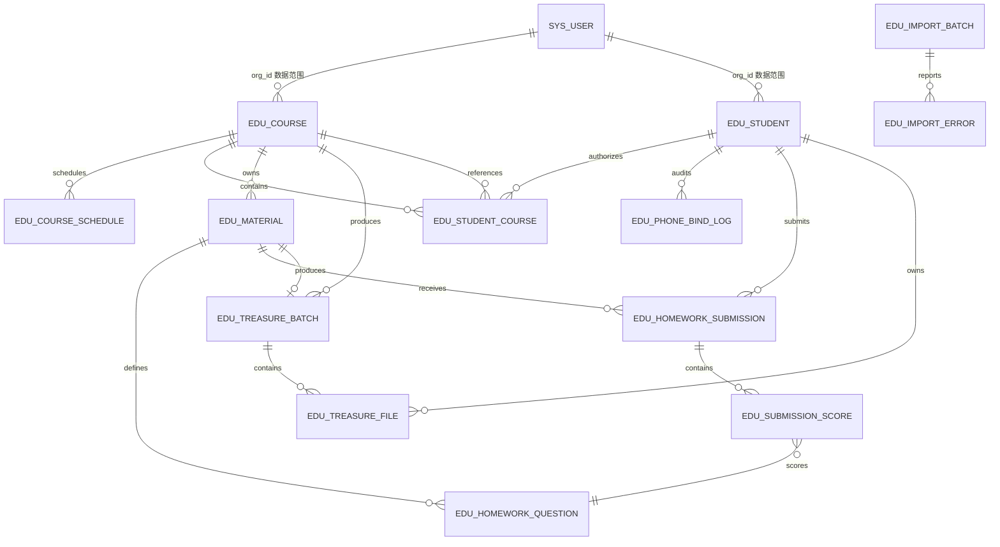

# E学慧通数据表结构设计

> 本文基于 `backend/src/main/resources/db/migration/V1__initial_schema.sql`、`V2__dicts_and_permissions.sql` 的实际 DDL，并结合各 Service 的真实数据访问逻辑整理而成，是 `design.md` 领域模型部分的落地详表。
>
- 数据库：MySQL 8（测试/本地用 H2 MySQL 模式）
- 迁移工具：Flyway，`V1` 建业务表，`V2` 建字典与权限菜单
- 字符集：utf8mb4，时区 `Asia/Shanghai`
- 所有业务表带逻辑删除，时间字段统一 `TIMESTAMP`，应用层时区已配置

## 1. 数据框架总览

系统按业务边界划分为 8 个数据域，对应后端 `com.huijulh.study` 下的包结构：

| 数据域 | 包 | 主要表 | 职责 |
| --- | --- | --- | --- |
| 系统管理 | `security` | `sys_user`、`sys_dict_type`、`sys_dict_data`、`sys_menu` | 管理员账号、字典、菜单权限 |
| 课程 | `course` | `edu_course`、`edu_course_schedule` | 课程主数据、课次时间 |
| 学员 | `student` | `edu_student`、`edu_student_course`、`edu_phone_bind_log` | 学员、多课程授权、手机号绑定审计 |
| 资料与作业 | `material` | `edu_material`、`edu_homework_question`、`edu_homework_submission`、`edu_submission_score` | 资料、物理作业题目结构、学生提交与小题分 |
| 提分宝 | `treasure` | `edu_treasure_batch`、`edu_treasure_file`、`edu_treasure_parse_error` | 批次、学生个人文件、解析错误 |
| 文件令牌 | `storage` | `edu_file_token`、`edu_file_cleanup_task` | 一次性上传/解析令牌、正式文件清理任务 |
| Excel 导入 | `student` | `edu_import_batch`、`edu_import_error` | 导入校验批次、错误明细 |
| 集成审计 | `studentauth` | `edu_xiaoe_request_log` | 小鹅通开课幂等日志 |

### 领域关系图

## 2. 设计约定

### 2.1 命名规范

- 系统表前缀 `sys_`，业务表前缀 `edu_`。
- 主键统一 `<表名单数>_id`，`BIGINT AUTO_INCREMENT`。
- 外键列 `<引用表单数>_id`，如 `student_id`、`course_id`。
- 时间字段 `_time` 后缀，审计操作人 `_by` 后缀。
- 布尔/标志位用 `TINYINT`（0/1），枚举用 `VARCHAR` 存字符串常量。

### 2.2 通用审计字段

业务主表均包含以下字段（由 `SecurityContext.username()` / `orgId()` 写入）：

| 字段 | 类型 | 说明 |
| --- | --- | --- |
| `create_by` | VARCHAR(64) | 创建人用户名 |
| `create_time` | TIMESTAMP NOT NULL DEFAULT CURRENT_TIMESTAMP | 创建时间 |
| `update_by` | VARCHAR(64) | 最后修改人 |
| `update_time` | TIMESTAMP NOT NULL DEFAULT CURRENT_TIMESTAMP | 最后修改时间，Service 更新时显式置 `CURRENT_TIMESTAMP` |
| `remark` | VARCHAR(500) | 备注，预留 |

### 2.3 逻辑删除与唯一约束共存（核心技巧）

为同时满足「逻辑删除」与「业务键唯一」，采用 `deleted` + `active_key` 双字段：

| 字段 | 类型 | 未删除 | 已删除 |
| --- | --- | --- | --- |
| `deleted` | TINYINT NOT NULL DEFAULT 0 | `0` | `1` |
| `active_key` | TINYINT NULL DEFAULT 1 | `1` | `NULL` |

唯一约束中包含 `active_key`：未删除记录 `active_key=1` 参与唯一校验；删除后置 `active_KEY=NULL`，而 `NULL` 在 MySQL/H2 唯一索引中不参与比较，从而允许同业务键的历史记录共存，新记录可重新插入。

> 当前 `edu_course`、`edu_student`、`edu_treasure_batch` 使用此模式；`edu_student_course`、`edu_material`、`edu_homework_question`、`edu_treasure_file` 等仅用 `deleted` 标志，其唯一约束含 `deleted` 列（0 时唯一，删除后不再校验，因删除记录的 `deleted` 值为 1 仍会参与唯一比较，故这些表的实际删除语义是「彻底不再插入同键」，由应用层保证）。

### 2.4 乐观锁

高风险并发表含 `version INT NOT NULL DEFAULT 0`，更新时 `version=version+1`，用于覆盖并发编辑保护：

- `edu_course`、`edu_student`、`edu_material`

### 2.5 枚举常量

| 枚举 | 取值 | 说明 |
| --- | --- | --- |
| 年级 `grade` | `SENIOR_ONE` / `SENIOR_TWO` / `SENIOR_THREE` | 高一/高二/高三 |
| 学科 `subject` | `MATH_ELITE` / `MATH_ADVANCE` / `PHYSICS` / `ENGLISH` / `CHINESE` | 数学培优/数学跃升/物理/英语/语文 |
| 资料类型 `material_type` | `HANDOUT` / `HOMEWORK` | 讲义/作业 |
| 课程状态 `status` | `ENABLED` / `DISABLED` | 启用/停用 |
| 学员状态 `status` | `ENABLED` / `DISABLED` | 启用/停用 |
| 手机号来源 `phone_source` | `ADMIN` / `EXCEL` / `H5_VERIFIED` / `ADMIN_CLEAR` | 后台录入/Excel导入/H5验证/后台清空 |
| 授权来源 `source`(授权关系) | `ADMIN` / `EXCEL` / `SYSTEM` | 后台/导入/系统 |
| 提分宝批次发布状态 `publish_status` | `DRAFT` / `PUBLISHED` / `REVOKED` | 草稿/已发布/已撤销 |
| 文件令牌业务类型 `business_type` | `MATERIAL_UPLOAD` / `TREASURE_PARSE` | 资料上传/提分宝解析 |

## 3. 表结构详表

### 3.1 系统管理域

#### 3.1.1 `sys_user` 管理员账号

管理端登录账号，当前为简化独立体系（未接若依完整用户/角色），权限以逗号分隔字符串存储，`*` 表示全部权限。

| 字段 | 类型 | 约束 | 说明 |
| --- | --- | --- | --- |
| `user_id` | BIGINT | PK AUTO_INCREMENT | 主键 |
| `username` | VARCHAR(64) | NOT NULL UNIQUE | 登录用户名 |
| `password_hash` | VARCHAR(100) | NOT NULL | BCrypt 密文，前缀 `{bcrypt}` |
| `display_name` | VARCHAR(64) | NOT NULL | 显示昵称 |
| `org_id` | BIGINT | NOT NULL | 所属业务组织，用于数据范围过滤 |
| `enabled` | TINYINT | NOT NULL DEFAULT 1 | 是否启用 |
| `permissions` | VARCHAR(2000) | NOT NULL | 权限标识逗号分隔，`*` 为超管 |
| `create_time` | TIMESTAMP | NOT NULL DEFAULT CURRENT_TIMESTAMP | 创建时间 |

- **唯一约束**：`uk_sys_user_username(username)`
- **初始数据**：`admin`（BCrypt 密码，`permissions='*'`，`org_id=1`）
- **登录逻辑**：`AuthController.login` 按 `username` 查询，`PasswordEncoder.matches` 校验后签发 JWT；JWT claim 含 `userId/username/displayName/orgId/permissions`。

#### 3.1.2 `sys_dict_type` 字典类型

| 字段 | 类型 | 约束 | 说明 |
| --- | --- | --- | --- |
| `dict_id` | BIGINT | PK AUTO_INCREMENT | 主键 |
| `dict_name` | VARCHAR(100) | NOT NULL | 字典名称 |
| `dict_type` | VARCHAR(100) | NOT NULL UNIQUE | 字典类型编码 |
| `status` | CHAR(1) | NOT NULL DEFAULT '0' | 状态（0 正常） |
| `create_time` | TIMESTAMP | NOT NULL DEFAULT CURRENT_TIMESTAMP | |

- **唯一约束**：`uk_dict_type(dict_type)`

#### 3.1.3 `sys_dict_data` 字典数据项

| 字段 | 类型 | 约束 | 说明 |
| --- | --- | --- | --- |
| `dict_code` | BIGINT | PK AUTO_INCREMENT | 主键 |
| `dict_sort` | INT | NOT NULL DEFAULT 0 | 排序 |
| `dict_label` | VARCHAR(100) | NOT NULL | 显示文本（如"高一"） |
| `dict_value` | VARCHAR(100) | NOT NULL | 实际值（如 `SENIOR_ONE`） |
| `dict_type` | VARCHAR(100) | NOT NULL | 所属字典类型 |
| `status` | CHAR(1) | NOT NULL DEFAULT '0' | |
| `create_time` | TIMESTAMP | NOT NULL DEFAULT CURRENT_TIMESTAMP | |

- **唯一约束**：`uk_dict_value(dict_type, dict_value)`
- **已初始化字典**：见第 5 节。

#### 3.1.4 `sys_menu` 菜单与按钮权限

| 字段 | 类型 | 约束 | 说明 |
| --- | --- | --- | --- |
| `menu_id` | BIGINT | PK | 菜单 ID（手动指定，预留固定 ID） |
| `menu_name` | VARCHAR(100) | NOT NULL | 菜单名称 |
| `parent_id` | BIGINT | NOT NULL DEFAULT 0 | 父菜单 ID，0 为顶级 |
| `order_num` | INT | NOT NULL DEFAULT 0 | 排序 |
| `path` | VARCHAR(200) | | 路由路径 |
| `component` | VARCHAR(255) | | 前端组件路径 |
| `menu_type` | CHAR(1) | NOT NULL | `M` 目录 / `C` 菜单 / `F` 按钮 |
| `perms` | VARCHAR(100) | | 权限标识（如 `study:student:list`） |
| `visible` | CHAR(1) | NOT NULL DEFAULT '0' | 是否可见 |
| `status` | CHAR(1) | NOT NULL DEFAULT '0' | |

- **已初始化菜单**：见第 5 节（menu_id 2000-2133）。

### 3.2 课程域

#### 3.2.1 `edu_course` 课程主数据

| 字段 | 类型 | 约束 | 说明 |
| --- | --- | --- | --- |
| `course_id` | BIGINT | PK AUTO_INCREMENT | 主键 |
| `org_id` | BIGINT | NOT NULL | 业务组织，数据范围 |
| `grade` | VARCHAR(32) | NOT NULL | 年级枚举 |
| `subject` | VARCHAR(32) | NOT NULL | 学科枚举 |
| `course_name` | VARCHAR(100) | NOT NULL | 课程名，默认 `年级名+学科名` 拼接 |
| `source_value` | VARCHAR(500) | NOT NULL | 原始小鹅通链接或课程 ID |
| `external_course_id` | VARCHAR(128) | NOT NULL | `XiaoeCourseClient` 解析出的课程 ID |
| `external_course_url` | VARCHAR(500) | | 规范化课程地址 |
| `goods_img` | VARCHAR(500) | | 小鹅通商品图 URL |
| `lecturer_name` | VARCHAR(30) | NOT NULL | 讲师姓名 |
| `lecturer_avatar_key` | VARCHAR(500) | | 讲师头像存储键（非外部 URL） |
| `learning_levels` | VARCHAR(64) | | 旧 H5 兼容字段，当前管理端不维护，默认 NULL |
| `status` | VARCHAR(16) | NOT NULL DEFAULT 'ENABLED' | 课程状态 |
| `sort_order` | INT | NOT NULL DEFAULT 0 | 排序，旧 H5 主课程回退选择用 |
| `version` | INT | NOT NULL DEFAULT 0 | 乐观锁 |
| `active_key` | TINYINT | NULL DEFAULT 1 | 逻辑删除辅助 |
| `deleted` | TINYINT | NOT NULL DEFAULT 0 | 逻辑删除 |
| 审计字段 | | | `create_by/create_time/update_by/update_time/remark` |

- **唯一约束**：`uk_course_org_grade_subject_active(org_id, grade, subject, active_key)` —— 同组织同年级同学科仅一门有效课程。
- **索引**：`idx_course_org_status(org_id, status, deleted)`
- **业务规则**（`CourseService`）：
  - 新增/更新前调用 `XiaoeCourseClient.validate(sourceValue)` 解析并校验，失败抛 `INVALID_XIAOE_COURSE`，不写库。
  - `DuplicateKeyException` → `COURSE_CONFLICT`。
  - 删除前检查学员授权/资料/提分宝三类关联计数，任一 > 0 抛 `COURSE_REFERENCED`；否则逻辑删除（`deleted=1, active_key=NULL`）。
  - 停用保留历史授权与资料。

#### 3.2.2 `edu_course_schedule` 课次时间

| 字段 | 类型 | 约束 | 说明 |
| --- | --- | --- | --- |
| `schedule_id` | BIGINT | PK AUTO_INCREMENT | 主键 |
| `course_id` | BIGINT | NOT NULL FK | 所属课程 |
| `start_time` | TIMESTAMP | NOT NULL | 开始时间 |
| `end_time` | TIMESTAMP | NOT NULL | 结束时间 |
| `deleted` | TINYINT | NOT NULL DEFAULT 0 | 逻辑删除 |
| `create_time` | TIMESTAMP | NOT NULL DEFAULT CURRENT_TIMESTAMP | |

- **索引**：`idx_schedule_course_time(course_id, start_time, deleted)`
- **外键**：`fk_schedule_course → edu_course(course_id)`
- **业务规则**：
  - 更新课程时对课次采用**全量删除重建**语义（`DELETE FROM edu_course_schedule WHERE course_id=?` 再插入）。
  - 保存前按 `start_time` 排序校验：`end_time` 必须晚于 `start_time`（否则 `SCHEDULE_END_INVALID`），相邻课次不得重叠（否则 `SCHEDULE_OVERLAP`）。

### 3.3 学员域

#### 3.3.1 `edu_student` 学员

| 字段 | 类型 | 约束 | 说明 |
| --- | --- | --- | --- |
| `student_id` | BIGINT | PK AUTO_INCREMENT | 主键（管理端 `studentId`） |
| `org_id` | BIGINT | NOT NULL | 业务组织 |
| `school` | VARCHAR(100) | NOT NULL | 学校 |
| `grade` | VARCHAR(32) | NOT NULL | 年级枚举 |
| `class_name` | VARCHAR(50) | NOT NULL | 班级 |
| `student_name` | VARCHAR(50) | NOT NULL | 姓名 |
| `student_no` | VARCHAR(64) | NOT NULL | 学号（旧 H5 的 `studentId` 字段） |
| `learning_levels` | VARCHAR(64) | | 旧 H5 学习分层，可空 |
| `authorized_phone` | VARCHAR(255) | | 手机号 AES/GCM 密文（Base64） |
| `phone_hash` | CHAR(64) | | 手机号 HmacSHA256 hex，用于唯一与精确查询 |
| `phone_source` | VARCHAR(32) | | 手机号来源 |
| `phone_verified_at` | TIMESTAMP | NULL | H5 验证时间 |
| `status` | VARCHAR(16) | NOT NULL DEFAULT 'ENABLED' | 学员状态 |
| `version` | INT | NOT NULL DEFAULT 0 | 乐观锁 |
| `active_key` | TINYINT | NULL DEFAULT 1 | 逻辑删除辅助 |
| `deleted` | TINYINT | NOT NULL DEFAULT 0 | 逻辑删除 |
| 审计字段 | | | |

- **唯一约束**：
  - `uk_student_org_no_active(org_id, student_no, active_key)` —— 同组织学号唯一。
  - `uk_student_phone_hash_active(phone_hash, active_key)` —— 有效手机号全局唯一（一个手机号只能绑定一个有效学员）。
- **索引**：`idx_student_search(org_id, grade, school, deleted)`
- **业务规则**（`StudentService` + `PhoneProtector`）：
  - 手机号经 `PhoneProtector.normalize` 校验（`^1\d{10}$`），`encrypt` 存密文，`hash` 存 HMAC。
  - 列表/导出仅返回 `phoneProtector.mask` 脱敏值（前 3 **** 后 4），不返回明文。
  - 关键词为 11 位手机号时按 `phone_hash` 精确匹配，但响应仍脱敏。
  - `DuplicateKeyException` 后用 `conflictFor` 二次判定是学号冲突（`STUDENT_NO_CONFLICT`）还是手机号冲突（`PHONE_CONFLICT`）。
  - 详情接口返回明文手机号（供编辑回显），列表接口不返回。

#### 3.3.2 `edu_student_course` 学员-课程授权关系

| 字段 | 类型 | 约束 | 说明 |
| --- | --- | --- | --- |
| `relation_id` | BIGINT | PK AUTO_INCREMENT | 主键 |
| `student_id` | BIGINT | NOT NULL FK | 学员 |
| `course_id` | BIGINT | NOT NULL FK | 课程 |
| `is_primary` | TINYINT | NOT NULL DEFAULT 0 | 是否主课程（旧 H5 单课程兼容） |
| `authorized_at` | TIMESTAMP | NOT NULL DEFAULT CURRENT_TIMESTAMP | 授权时间 |
| `source` | VARCHAR(32) | NOT NULL | 授权来源 |
| `deleted` | TINYINT | NOT NULL DEFAULT 0 | 逻辑删除 |
| `create_time` | TIMESTAMP | NOT NULL DEFAULT CURRENT_TIMESTAMP | |

- **唯一约束**：`uk_student_course_deleted(student_id, course_id, deleted)` —— 一个有效学员课程组合唯一。
- **索引**：`idx_student_primary(student_id, is_primary, deleted)`、`idx_course_students(course_id, deleted)`
- **外键**：`fk_student_course_student → edu_student`、`fk_student_course_course → edu_course`
- **业务规则**（`StudentService.replaceCourses`）：
  - 保存学员时授权关系**全量覆盖**：先 `DELETE FROM edu_student_course WHERE student_id=?`，再按新课程列表插入。
  - **唯一主课程维护**：优先 `requestedPrimary` → 保留旧主课程 → 取课程列表第一门；恰好一条 `is_primary=1`。
  - 授权课程必须存在且 `status='ENABLED'`，否则 `COURSE_NOT_FOUND`。
  - 旧 `/auth/*` 通过 `is_primary=1` 的关系返回单课程信息。

#### 3.3.3 `edu_phone_bind_log` 手机号绑定审计

| 字段 | 类型 | 约束 | 说明 |
| --- | --- | --- | --- |
| `log_id` | BIGINT | PK AUTO_INCREMENT | 主键 |
| `student_id` | BIGINT | NOT NULL | 学员 |
| `old_phone_masked` | VARCHAR(32) | | 变更前脱敏手机号 |
| `new_phone_masked` | VARCHAR(32) | | 变更后脱敏手机号 |
| `source` | VARCHAR(32) | NOT NULL | `ADMIN` / `ADMIN_CLEAR` / `H5_VERIFIED` |
| `operator` | VARCHAR(64) | | 操作人（管理员用户名或 `student`） |
| `device_summary` | VARCHAR(255) | | H5 绑定时截取的 User-Agent（≤250 字符） |
| `create_time` | TIMESTAMP | NOT NULL DEFAULT CURRENT_TIMESTAMP | |

- **索引**：`idx_phone_log_student(student_id, create_time)`
- **业务规则**：仅记录脱敏值，不记录明文；后台改手机号、后台清空手机号、H5 绑定均写审计。

### 3.4 资料与作业域

#### 3.4.1 `edu_material` 课程资料

| 字段 | 类型 | 约束 | 说明 |
| --- | --- | --- | --- |
| `material_id` | BIGINT | PK AUTO_INCREMENT | 主键 |
| `org_id` | BIGINT | NOT NULL | 业务组织 |
| `course_id` | BIGINT | NOT NULL FK | 所属课程 |
| `material_type` | VARCHAR(16) | NOT NULL | `HANDOUT` / `HOMEWORK` |
| `file_name` | VARCHAR(255) | NOT NULL | 原始文件名（展示用） |
| `storage_key` | VARCHAR(500) | NOT NULL | 正式存储键（随机 UUID 路径） |
| `file_size` | BIGINT | NOT NULL | 字节 |
| `file_extension` | VARCHAR(20) | NOT NULL | 扩展名 |
| `mime_type` | VARCHAR(100) | NOT NULL | 内容检测 MIME |
| `open_time` | TIMESTAMP | NOT NULL | 开放时间（`openStatus` 据此动态计算） |
| `submit_deadline` | TIMESTAMP | NULL | 物理作业提交截止时间，讲义为 NULL |
| `status` | VARCHAR(16) | NOT NULL DEFAULT 'ENABLED' | |
| `version` | INT | NOT NULL DEFAULT 0 | 乐观锁 |
| `deleted` | TINYINT | NOT NULL DEFAULT 0 | 逻辑删除 |
| 审计字段 | | | |

- **索引**：`idx_material_course_open(course_id, open_time, deleted)`
- **外键**：`fk_material_course → edu_course`
- **业务规则**（`MaterialService`）：
  - `openStatus` 不落库，查询时 `LocalDateTime.now().isBefore(open_time)` → `SCHEDULED`，否则 `OPEN`。
  - 批量新增：消费 `MATERIAL_UPLOAD` 令牌 → 临时文件 `moveToFormal` → 事务内写库；任一失败不部分提交。
  - 物理作业（`subject=PHYSICS` 且 `type=HOMEWORK`）必须配置 `submit_deadline` 且晚于 `open_time`。
  - 已有提交（`submitted_count>0`）时禁止修改题目结构（`HOMEWORK_STRUCTURE_LOCKED`），但可改开放时间。
  - 作业已有提交记录时禁止删除。

#### 3.4.2 `edu_homework_question` 物理作业题目结构

| 字段 | 类型 | 约束 | 说明 |
| --- | --- | --- | --- |
| `question_id` | BIGINT | PK AUTO_INCREMENT | 主键 |
| `material_id` | BIGINT | NOT NULL FK | 所属作业资料 |
| `question_no` | INT | NOT NULL | 题号，从 1 连续 |
| `full_score` | DECIMAL(6,2) | NOT NULL | 每题满分（1-20） |
| `required_flag` | TINYINT | NOT NULL DEFAULT 1 | 是否必答 |
| `allow_decimal` | TINYINT | NOT NULL DEFAULT 1 | 是否允许小数分 |
| `deleted` | TINYINT | NOT NULL DEFAULT 0 | 逻辑删除 |

- **唯一约束**：`uk_question_material_no_deleted(material_id, question_no, deleted)`
- **外键**：`fk_question_material → edu_material`
- **业务规则**：
  - 题目数 1-30，题号必须连续，每题满分 1-20。
  - 模型使用 `DECIMAL(6,2)` 而非整数，为学生得 0 分、半分及后续扩展留空间。
  - 无提交时更新作业会先 `DELETE` 再重建题目；有提交时不重建。

#### 3.4.3 `edu_homework_submission` 作业提交

| 字段 | 类型 | 约束 | 说明 |
| --- | --- | --- | --- |
| `submission_id` | BIGINT | PK AUTO_INCREMENT | 主键 |
| `student_id` | BIGINT | NOT NULL FK | 学员 |
| `material_id` | BIGINT | NOT NULL FK | 作业 |
| `status` | VARCHAR(20) | NOT NULL | 提交状态 |
| `submitted_at` | TIMESTAMP | NULL | 提交时间 |
| `idempotency_key` | VARCHAR(128) | | 幂等键 |
| `active_flag` | TINYINT | NULL DEFAULT 1 | 有效提交标志（同 `active_key` 语义） |
| `create_time` | TIMESTAMP | NOT NULL DEFAULT CURRENT_TIMESTAMP | |

- **唯一约束**：`uk_submission_active(student_id, material_id, active_flag)` —— 一学生对一作业仅一条有效提交。
- **外键**：`fk_submission_student`、`fk_submission_material`
- **说明**：本期管理端不直接写入，但小题分导出（`SubmissionExportController`）依赖此表 LEFT JOIN 包含未提交学生。

#### 3.4.4 `edu_submission_score` 小题分

| 字段 | 类型 | 约束 | 说明 |
| --- | --- | --- | --- |
| `score_id` | BIGINT | PK AUTO_INCREMENT | 主键 |
| `submission_id` | BIGINT | NOT NULL FK | 提交记录 |
| `question_id` | BIGINT | NOT NULL FK | 题目 |
| `score` | DECIMAL(6,2) | NOT NULL | 学生得分，支持 0 和小数 |

- **唯一约束**：`uk_submission_question(submission_id, question_id)`
- **外键**：`fk_score_submission`、`fk_score_question`
- **说明**：导出时按 `question_no` 动态生成列，未提交学生该列为空。

### 3.5 提分宝域

#### 3.5.1 `edu_treasure_batch` 提分宝批次

| 字段 | 类型 | 约束 | 说明 |
| --- | --- | --- | --- |
| `batch_id` | BIGINT | PK AUTO_INCREMENT | 主键 |
| `org_id` | BIGINT | NOT NULL | 业务组织 |
| `course_id` | BIGINT | NOT NULL FK | 课程 |
| `homework_material_id` | BIGINT | NOT NULL FK | 关联作业资料 |
| `source_zip_name` | VARCHAR(255) | NOT NULL | 原始 ZIP 文件名 |
| `source_zip_storage_key` | VARCHAR(500) | | ZIP 正式存储键 |
| `parse_status` | VARCHAR(20) | NOT NULL | 解析状态（`SUCCESS`/`FAILED`） |
| `publish_status` | VARCHAR(20) | NOT NULL | `DRAFT`/`PUBLISHED`/`REVOKED` |
| `parsed_file_count` | INT | NOT NULL DEFAULT 0 | 解析出的有效文件数 |
| `published_at` | TIMESTAMP | NULL | 发布时间，MVP 确认即发布 |
| `active_flag` | TINYINT | NULL DEFAULT 1 | 逻辑删除辅助 |
| `deleted` | TINYINT | NOT NULL DEFAULT 0 | 逻辑删除 |
| `create_by` | VARCHAR(64) | | |
| `create_time` | TIMESTAMP | NOT NULL DEFAULT CURRENT_TIMESTAMP | |
| `update_time` | TIMESTAMP | NOT NULL DEFAULT CURRENT_TIMESTAMP | |

- **唯一约束**：`uk_treasure_homework_active(homework_material_id, active_flag)` —— **一个作业只能有一个未删除的有效提分宝批次**。
- **索引**：`idx_treasure_course(course_id, deleted)`
- **外键**：`fk_treasure_course`、`fk_treasure_homework → edu_material`
- **业务规则**（`TreasureService`）：
  - 确认时 `DuplicateKeyException` → `TREASURE_CONFLICT`（该作业已上传过）。
  - MVP 确认即发布：`publish_status='PUBLISHED'`，`published_at=CURRENT_TIMESTAMP`。
  - 删除为逻辑删除：`deleted=1, active_flag=NULL, publish_status='REVOKED'`，释放唯一约束使作业可重新上传。
  - 关联作业必须 `material_type='HOMEWORK'` 且 `open_time<=now`（已对学生显示）。

#### 3.5.2 `edu_treasure_file` 学生个人文件

| 字段 | 类型 | 约束 | 说明 |
| --- | --- | --- | --- |
| `treasure_file_id` | BIGINT | PK AUTO_INCREMENT | 主键 |
| `batch_id` | BIGINT | NOT NULL FK | 所属批次 |
| `student_id` | BIGINT | NOT NULL FK | 归属学生 |
| `student_no_snapshot` | VARCHAR(64) | NOT NULL | 解析时学号快照 |
| `file_name` | VARCHAR(255) | NOT NULL | 原始文件名 |
| `storage_key` | VARCHAR(500) | NOT NULL | 正式存储键 |
| `file_size` | BIGINT | NOT NULL | 字节 |
| `file_hash` | CHAR(64) | NOT NULL | SHA-256 |
| `file_version` | INT | NOT NULL DEFAULT 1 | 文件版本，预留替换 |
| `publish_status` | VARCHAR(20) | NOT NULL | `PUBLISHED`/`REVOKED` |
| `expire_time` | TIMESTAMP | NULL | 过期时间，NULL 永久 |
| `download_count` | INT | NOT NULL DEFAULT 0 | 下载次数 |
| `last_download_time` | TIMESTAMP | NULL | 最近下载时间 |
| `deleted` | TINYINT | NOT NULL DEFAULT 0 | 逻辑删除 |

- **唯一约束**：`uk_treasure_batch_student_deleted(batch_id, student_id, deleted)` —— 一批次内一学生一文件。
- **外键**：`fk_treasure_file_batch`、`fk_treasure_file_student`
- **业务规则**：
  - 学生下载（`/auth/treasure-files/{fileId}/download`）校验 `student_id` 归属 + `PUBLISHED` + 未过期，自增 `download_count`。
  - 学生只能下载属于自己的个人文件，不能直接访问 ZIP 或他人文件。
  - 删除批次时个人文件一并逻辑删除（`deleted=1, publish_status='REVOKED'`）。

#### 3.5.3 `edu_treasure_parse_error` 提分宝解析错误

| 字段 | 类型 | 约束 | 说明 |
| --- | --- | --- | --- |
| `error_id` | BIGINT | PK AUTO_INCREMENT | 主键 |
| `token_value` | CHAR(64) | NOT NULL | 关联解析令牌 |
| `file_path` | VARCHAR(500) | | ZIP 内文件路径 |
| `student_no` | VARCHAR(64) | | 解析出的学号 |
| `message` | VARCHAR(500) | NOT NULL | 错误原因 |

- **说明**：解析阶段产生的错误（类型不允许、学号不匹配、重复学号、空文件、路径穿越等）按 `parseToken` 关联存储，供前端展示错误清单。

### 3.6 文件令牌与清理域

#### 3.6.1 `edu_file_token` 一次性文件令牌

用于资料上传、提分宝解析的临时令牌，保证一次性消费与幂等。

| 字段 | 类型 | 约束 | 说明 |
| --- | --- | --- | --- |
| `token_id` | BIGINT | PK AUTO_INCREMENT | 主键 |
| `token_value` | CHAR(64) | NOT NULL UNIQUE | 令牌值（UUID 去横线） |
| `business_type` | VARCHAR(32) | NOT NULL | `MATERIAL_UPLOAD` / `TREASURE_PARSE` |
| `operator_id` | BIGINT | NOT NULL | 发起操作的管理员 |
| `org_id` | BIGINT | NOT NULL | 组织 |
| `payload_json` | TEXT | NOT NULL | 令牌载荷（文件临时键、文件名、大小、解析文件清单等） |
| `expires_at` | TIMESTAMP | NOT NULL | 过期时间（默认 30 分钟） |
| `used_at` | TIMESTAMP | NULL | 消费时间，NULL 表示未使用 |
| `create_time` | TIMESTAMP | NOT NULL DEFAULT CURRENT_TIMESTAMP | |

- **唯一约束**：`uk_file_token_value(token_value)`
- **业务规则**（`FileTokenService.consume`）：
  - 消费时 `SELECT ... FOR UPDATE`，校验 `used_at IS NULL AND expires_at>CURRENT_TIMESTAMP` 且归属当前操作员与组织。
  - 更新 `used_at` 影响行数必须为 1，否则视为重复消费抛令牌过期错误。
  - `MATERIAL_UPLOAD` 载荷含 `tempKey/fileName/fileSize/extension/mimeType`。
  - `TREASURE_PARSE` 载荷含 `courseId/homeworkMaterialId/zipTempKey/files(学生匹配清单)/canSubmit`。

#### 3.6.2 `edu_file_cleanup_task` 文件清理任务

| 字段 | 类型 | 约束 | 说明 |
| --- | --- | --- | --- |
| `task_id` | BIGINT | PK AUTO_INCREMENT | 主键 |
| `storage_key` | VARCHAR(500) | NOT NULL | 待清理存储键 |
| `reason` | VARCHAR(255) | NOT NULL | 清理原因 |
| `status` | VARCHAR(20) | NOT NULL DEFAULT 'PENDING' | `PENDING`/`DONE`/`FAILED` |
| `retry_count` | INT | NOT NULL DEFAULT 0 | 重试次数 |
| `next_retry_time` | TIMESTAMP | NULL | 下次重试时间 |
| `create_time` | TIMESTAMP | NOT NULL DEFAULT CURRENT_TIMESTAMP | |

- **说明**：资料批量新增数据库失败后登记正式文件清理任务；头像替换、临时目录清理预留。当前为表结构预留，定时清理任务待上线前接入。

### 3.7 Excel 导入域

#### 3.7.1 `edu_import_batch` 导入校验批次

| 字段 | 类型 | 约束 | 说明 |
| --- | --- | --- | --- |
| `batch_id` | BIGINT | PK AUTO_INCREMENT | 主键 |
| `token_value` | CHAR(64) | NOT NULL UNIQUE | 导入确认令牌 |
| `org_id` | BIGINT | NOT NULL | 组织 |
| `file_name` | VARCHAR(255) | NOT NULL | 上传文件名 |
| `payload_json` | TEXT | NOT NULL | 校验通过的有效行 JSON 数组 |
| `total_count` | INT | NOT NULL | 总行数 |
| `valid_count` | INT | NOT NULL | 有效行数 |
| `invalid_count` | INT | NOT NULL | 错误行数 |
| `expires_at` | TIMESTAMP | NOT NULL | 过期时间（30 分钟） |
| `used_at` | TIMESTAMP | NULL | 确认时间 |
| `create_by` | VARCHAR(64) | | |
| `create_time` | TIMESTAMP | NOT NULL DEFAULT CURRENT_TIMESTAMP | |

- **唯一约束**：`uk_import_token(token_value)`
- **业务规则**（`StudentExcelService`）：
  - 校验阶段只写本表与错误明细，不写正式学员表。
  - 确认时 `SELECT ... FOR UPDATE`，校验 `used_at IS NULL AND expires_at>CURRENT_TIMESTAMP`，且 `invalid_count=0` 才允许确认。
  - 确认时逐行调 `StudentService.create/update`，`updateSupport` 控制已存在学号是更新还是报错。
  - 重复确认同一令牌被 `used_at` 拦截。

#### 3.7.2 `edu_import_error` 导入错误明细

| 字段 | 类型 | 约束 | 说明 |
| --- | --- | --- | --- |
| `error_id` | BIGINT | PK AUTO_INCREMENT | 主键 |
| `batch_id` | BIGINT | NOT NULL FK | 所属批次 |
| `row_num` | INT | NOT NULL | Excel 行号（从 1 起，含表头） |
| `field_name` | VARCHAR(64) | | 字段名 |
| `field_value` | VARCHAR(500) | | 原值 |
| `message` | VARCHAR(500) | NOT NULL | 错误原因 |

- **外键**：`fk_import_error_batch → edu_import_batch`
- **校验规则**：必填校验、年级值合法、授权课程名存在且启用、手机号格式。

### 3.8 集成审计域

#### 3.8.1 `edu_xiaoe_request_log` 小鹅通请求幂等日志

| 字段 | 类型 | 约束 | 说明 |
| --- | --- | --- | --- |
| `request_id` | BIGINT | PK AUTO_INCREMENT | 主键 |
| `idempotency_key` | VARCHAR(128) | NOT NULL UNIQUE | 幂等键 |
| `operation` | VARCHAR(32) | NOT NULL | 操作类型（`OPEN_COURSE`） |
| `student_id` | BIGINT | | 学员 |
| `course_id` | BIGINT | | 课程 |
| `request_summary` | VARCHAR(1000) | | 请求摘要（脱敏） |
| `response_summary` | VARCHAR(1000) | | 响应摘要 |
| `status` | VARCHAR(20) | NOT NULL | `SUCCESS` 等 |
| `duration_ms` | BIGINT | | 耗时 |
| `create_time` | TIMESTAMP | NOT NULL DEFAULT CURRENT_TIMESTAMP | |

- **唯一约束**：`uk_xiaoe_idempotency(idempotency_key)`
- **业务规则**：H5 绑定手机号后记录开课请求，幂等键 `bind:{studentId}:{courseId}:{phoneHash}`，避免重试导致重复开通。当前 stub 模式占位，生产接入真实小鹅通客户端后启用。

## 4. 关键设计要点

### 4.1 手机号安全存储

- 明文不落库：`authorized_phone` 存 AES/GCM 密文（IV+密文 Base64），密钥来自 `PHONE_HASH_SECRET`（不入仓库）。
- `phone_hash` 存 HmacSHA256 hex，用于唯一约束与精确查询（关键词为完整手机号时匹配）。
- 列表/导出/日志一律返回 `mask` 脱敏值（前 3 **** 后 4），详情接口返回明文供编辑回显。
- 审计表 `edu_phone_bind_log` 仅存脱敏值。

### 4.2 多课程与唯一主课程

- 管理端支持学员授权多门课程，旧 `/auth/*` 只返回单课程。
- `edu_student_course.is_primary=1` 的关系作为旧接口返回课程。
- 保存时维护恰好一条主课程：优先指定 → 保留旧主 → 取第一门。
- 旧主课程被移除时按 `sort_order, course_id` 选择新主课程。

### 4.3 一次性令牌与幂等

- `edu_file_token`：资料上传、提分宝解析的临时令牌，`FOR UPDATE` 消费，`used_at` 防重复。
- `edu_import_batch`：Excel 导入校验令牌，确认时 `FOR UPDATE` 消费。
- `edu_xiaoe_request_log`：小鹅通开课幂等键，防重试重复开通。

### 4.4 数据库兜底唯一约束

所有业务唯一性均有数据库约束兜底，应用层冲突捕获 `DuplicateKeyException` 转为业务错误码：

| 业务唯一 | 约束 | 冲突错误码 |
| --- | --- | --- |
| 同组织学号 | `uk_student_org_no_active` | `STUDENT_NO_CONFLICT` (40903) |
| 有效手机号 | `uk_student_phone_hash_active` | `PHONE_CONFLICT` (40906) |
| 同组织年级学科课程 | `uk_course_org_grade_subject_active` | `COURSE_CONFLICT` (40904) |
| 学员课程组合 | `uk_student_course_deleted` | 数据完整性冲突 |
| 一作业一提分宝批次 | `uk_treasure_homework_active` | `TREASURE_CONFLICT` (40907) |

### 4.5 文件存储抽象

- 数据库只存 `storage_key`（随机 UUID 路径），不存公开 URL。
- 下载由后端流式输出或短期签名，校验鉴权后返回。
- 临时区/正式区分离，`moveToFormal` 后才写正式表。
- `edu_file_cleanup_task` 兜底数据库失败后的正式文件清理。

## 5. 字典与权限菜单初始数据

### 5.1 字典类型

| dict_type | dict_name |
| --- | --- |
| `edu_grade` | 年级 |
| `edu_subject` | 学科 |
| `edu_material_type` | 资料类型 |
| `edu_course_status` | 课程状态 |

### 5.2 字典数据

| dict_type | dict_value | dict_label |
| --- | --- | --- |
| `edu_grade` | `SENIOR_ONE` | 高一 |
| `edu_grade` | `SENIOR_TWO` | 高二 |
| `edu_grade` | `SENIOR_THREE` | 高三 |
| `edu_subject` | `MATH_ELITE` | 数学培优 |
| `edu_subject` | `MATH_ADVANCE` | 数学跃升 |
| `edu_subject` | `PHYSICS` | 物理 |
| `edu_subject` | `ENGLISH` | 英语 |
| `edu_subject` | `CHINESE` | 语文 |
| `edu_material_type` | `HANDOUT` | 讲义 |
| `edu_material_type` | `HOMEWORK` | 作业 |
| `edu_course_status` | `ENABLED` | 已启用 |
| `edu_course_status` | `DISABLED` | 已停用 |

### 5.3 菜单与按钮权限

| menu_id | menu_name | parent_id | type | perms |
| --- | --- | --- | --- | --- |
| 2000 | 学习信息管理 | 0 | M | |
| 2001 | 学员信息管理 | 2000 | C | `study:student:list` |
| 2010 | 学科课程管理 | 0 | M | |
| 2011 | 课程管理 | 2010 | C | `course:course:list` |
| 2012 | 课程资料管理 | 2010 | C | `course:material:list` |
| 2101 | 学员查询 | 2001 | F | `study:student:query` |
| 2102 | 学员新增 | 2001 | F | `study:student:add` |
| 2103 | 学员修改 | 2001 | F | `study:student:edit` |
| 2104 | 学员导入 | 2001 | F | `study:student:import` |
| 2105 | 学员导出 | 2001 | F | `study:student:export` |
| 2111 | 课程查询 | 2011 | F | `course:course:query` |
| 2112 | 课程新增 | 2011 | F | `course:course:add` |
| 2113 | 课程修改 | 2011 | F | `course:course:edit` |
| 2114 | 课程删除 | 2011 | F | `course:course:remove` |
| 2121 | 资料查询 | 2012 | F | `course:material:query` |
| 2122 | 资料新增 | 2012 | F | `course:material:add` |
| 2123 | 资料修改 | 2012 | F | `course:material:edit` |
| 2124 | 资料删除 | 2012 | F | `course:material:remove` |
| 2125 | 小题分导出 | 2012 | F | `course:material:export` |
| 2131 | 提分宝列表 | 2012 | F | `course:treasure:list` |
| 2132 | 提分宝上传 | 2012 | F | `course:treasure:add` |
| 2133 | 提分宝删除 | 2012 | F | `course:treasure:remove` |

> 当前管理端 Controller 用 `@PreAuthorize("@auth.has('xxx')")` 校验，`admin` 账号 `permissions='*'` 通过所有校验。接入若依完整角色体系后，按钮权限由角色分配。

## 6. 表与后端模块对应关系

| 表 | 主要操作 Service / Controller |
| --- | --- |
| `sys_user` | `AuthController`（登录） |
| `edu_course`、`edu_course_schedule` | `CourseService` / `CourseController`、`CourseFileController` |
| `edu_student`、`edu_student_course` | `StudentService` / `StudentController` |
| `edu_phone_bind_log` | `StudentService`、`StudentAuthController` |
| `edu_material`、`edu_homework_question` | `MaterialService` / `MaterialController` |
| `edu_homework_submission`、`edu_submission_score` | `SubmissionExportController`（导出） |
| `edu_treasure_batch`、`edu_treasure_file` | `TreasureService` / `TreasureController`、`StudentAuthController`（下载） |
| `edu_treasure_parse_error` | `TreasureService` |
| `edu_file_token` | `FileTokenService` |
| `edu_file_cleanup_task` | 预留（定时清理任务） |
| `edu_import_batch`、`edu_import_error` | `StudentExcelService` / `StudentExcelController` |
| `edu_xiaoe_request_log` | `StudentAuthController`（绑定后记录） |

## 7. 上线前数据层遗留事项

1. 生产环境用真实 MySQL 8，H2 仅用于本地/测试。
2. `edu_file_cleanup_task` 定时清理任务待实现（当前表结构已就绪）。
3. `edu_xiaoe_request_log` 当前 stub 占位，接入真实小鹅通 SDK 后启用开课逻辑。
4. 若依完整用户/角色体系接入后，`sys_user.permissions` 字段可替换为角色关联表。
5. 高并发场景需对 `phone_hash` 唯一、提分宝批次唯一做压测验证。
