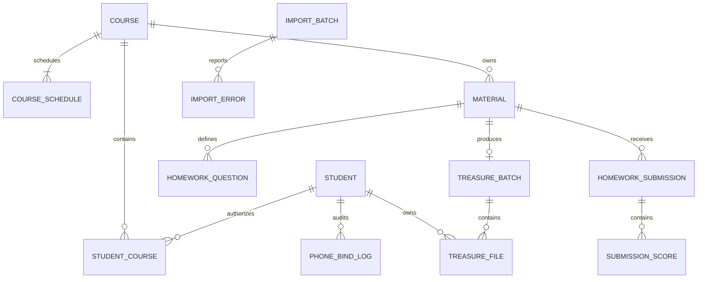

# Admin Web 后端技术设计

## 1. 设计结论

建议基于现有若依 Spring Boot 工程新增业务模块，不在本目录另起一套孤立服务。若实际后端仓库尚未提供，开发 thread 应先定位若依主仓库，再按本设计落位。

推荐模块边界：

```text
ruoyi-study
├── student            学员、课程授权、Excel 导入导出
├── course             课程、讲师头像、课次、小鹅通映射
├── material           资料、物理题目结构、临时上传
├── treasure           提分宝批次、学生个人文件、解析
├── studentauth        旧 /auth/* 兼容适配层
└── integration
    ├── xiaoe          小鹅通课程校验与开通
    └── storage        临时/正式文件存储抽象
```

管理端使用若依 JWT、权限标识和数据范围；学生认证接口继续使用现有 `token` 请求头与 Redis 令牌，不与管理员 JWT 混用。

## 2. 领域关系



## 3. 数据模型

所有业务表建议包含若依通用审计字段：`create_by`、`create_time`、`update_by`、`update_time`、`remark`，以及 `dept_id` 或明确的 `org_id` 数据范围字段。逻辑删除统一使用 `deleted`。

### 3.1 `edu_student`

| 字段 | 建议类型 | 约束/说明 |
| --- | --- | --- |
| student_id | bigint | 主键 |
| org_id | bigint | 业务组织 |
| school | varchar(100) | 必填 |
| grade | varchar(32) | 字典值 |
| class_name | varchar(50) | 必填 |
| student_name | varchar(50) | 必填 |
| student_no | varchar(64) | 业务组织内唯一 |
| learning_levels | varchar(64) | 旧 H5 兼容，可空 |
| authorized_phone | varchar(32) | 加密或受控存储 |
| phone_hash | char(64) | 用于唯一校验和精确查询 |
| phone_source | varchar(32) | ADMIN / EXCEL / H5_VERIFIED |
| phone_verified_at | datetime | 可空 |
| status | varchar(16) | ENABLED / DISABLED |
| deleted | tinyint | 逻辑删除 |

索引：

- `UNIQUE(org_id, student_no, deleted)`
- 本期手机号唯一时，为有效手机号建立可正确处理空值与逻辑删除的唯一约束；数据库不适合直接约束时，使用 `phone_hash` + 事务锁实现。

### 3.2 `edu_student_course`

| 字段 | 建议类型 | 约束/说明 |
| --- | --- | --- |
| relation_id | bigint | 主键 |
| student_id | bigint | 学员 |
| course_id | bigint | 课程 |
| is_primary | tinyint | 旧 H5 单课程兼容 |
| authorized_at | datetime | 授权时间 |
| source | varchar(32) | ADMIN / EXCEL / SYSTEM |
| deleted | tinyint | 逻辑删除 |

约束：

- 一个有效学员课程组合唯一。
- 一个学员必须恰好一条 `is_primary=1` 的有效关系。
- 编辑时优先保留原主课程；原主课程被取消时，按课程排序选择新的主课程并写审计日志。

### 3.3 `edu_course`

| 字段 | 建议类型 | 约束/说明 |
| --- | --- | --- |
| course_id | bigint | 主键 |
| org_id | bigint | 数据范围 |
| grade | varchar(32) | 字典值 |
| subject | varchar(32) | 字典值 |
| course_name | varchar(100) | 默认年级+学科 |
| source_value | varchar(500) | 原始链接或 ID |
| external_course_id | varchar(128) | 解析结果 |
| external_course_url | varchar(500) | 规范化地址 |
| lecturer_name | varchar(30) | 必填 |
| lecturer_avatar_key | varchar(500) | 存储键，不直接信任外部 URL |
| status | varchar(16) | ENABLED / DISABLED |
| deleted | tinyint | 逻辑删除 |

建议唯一约束：`UNIQUE(org_id, grade, subject, deleted)`。

### 3.4 `edu_course_schedule`

- `schedule_id`
- `course_id`
- `start_time`
- `end_time`
- `deleted`

应用层在事务内按开始时间排序检查重叠；更新采用全量覆盖语义，但对已有关联学习数据的课次禁止删除。

### 3.5 `edu_material`

| 字段 | 建议类型 | 说明 |
| --- | --- | --- |
| material_id | bigint | 主键 |
| course_id | bigint | 所属课程 |
| material_type | varchar(16) | HANDOUT / HOMEWORK |
| file_name | varchar(255) | 原始名 |
| storage_key | varchar(500) | 正式文件键 |
| file_size | bigint | 字节 |
| file_extension | varchar(20) | 扩展名 |
| mime_type | varchar(100) | 内容检测结果 |
| open_time | datetime | 开放时间 |
| submit_deadline | datetime | 物理作业可空/必填 |
| status | varchar(16) | ENABLED / DISABLED |
| deleted | tinyint | 逻辑删除 |

`openStatus` 不落库，根据数据库当前时间计算。

### 3.6 `edu_homework_question`

- `question_id`
- `material_id`
- `question_no`
- `full_score decimal(6,2)`
- `required_flag`
- `allow_decimal`
- `deleted`

后台页面当前输入整数满分，但模型使用 decimal，为学生得 0 分、半分和后续扩展留出空间。

### 3.7 作业提交与小题分

即使本期不实现新版 `/h5/homework/*`，为了导出能力应确认已有表或预留：

- `edu_homework_submission`：学生、作业、状态、首次/最近提交时间、幂等键。
- `edu_submission_file`：提交附件。
- `edu_submission_score`：提交、小题、学生得分 `decimal(6,2)`。

有效提交建议唯一约束：`UNIQUE(student_id, material_id, active_flag)`。

### 3.8 提分宝

`edu_treasure_batch`：

- `batch_id`
- `course_id`
- `homework_material_id`
- `source_zip_name`
- `source_zip_storage_key`
- `parse_status`
- `publish_status`：DRAFT / PUBLISHED / REVOKED
- `parsed_file_count`
- `published_at`
- `deleted`

`edu_treasure_file`：

- `treasure_file_id`
- `batch_id`
- `student_id`
- `student_no_snapshot`
- `file_name`
- `storage_key`
- `file_size`
- `file_hash`
- `file_version`
- `publish_status`
- `expire_time`
- `download_count`
- `last_download_time`
- `deleted`

数据库必须保证一个作业只有一个有效批次。学生下载接口查 `edu_treasure_file`，不能从 ZIP 临时解压目录直接返回。

### 3.9 临时任务和审计

- `edu_import_batch`、`edu_import_error`
- `edu_file_token` 或 Redis 临时令牌：MATERIAL_UPLOAD / TREASURE_PARSE
- `edu_phone_bind_log`
- `edu_treasure_parse_error`
- `edu_file_cleanup_task`

一次性令牌需要包含：业务类型、操作人、组织、文件列表、摘要、过期时间、使用时间。

## 4. 接口设计与兼容

### 4.1 管理端

管理端路径沿用原文档：

- `/study/student/**`
- `/course/course/**`
- `/course/material/**`
- `/course/treasure/**`

响应沿用若依 `AjaxResult` 和 `TableDataInfo`。分页列表统一返回 `rows/total`；非分页列表统一放在 `data`，避免同类接口混用。

### 4.2 旧学生认证接口

兼容层必须保留：

| 接口 | 兼容要求 |
| --- | --- |
| `GET /auth/schools` | 从 `edu_student` 去重，数据变更后主动失效缓存 |
| `GET /auth/grades` | 返回中文值，保持现有 H5 不改 |
| `POST /auth/verify-student` | 接受 `school/grade/name/studentId`，其中 `studentId` 实际为学号 |
| `POST /auth/bind-phone` | 使用请求头 `token`，保持 Redis 30 分钟令牌 |
| `GET /auth/bind-result` | 返回主课程和已开放资料 |
| `GET /auth/files/{fileId}/download` | 校验 token、课程授权、开放时间和文件归属 |

内部 DTO 必须区分：

- 数据库主键：`studentId: Long`
- 对外旧字段 `studentId: String`：学号
- 旧字段 `id: String`：数据库主键的字符串表示

不得因为字段同名而在 Mapper/DTO 中混用。

### 4.3 单课程兼容策略

旧 `/auth/*` 只返回一门课程，而管理端允许多课程授权：

1. `edu_student_course.is_primary=1` 的课程作为旧接口返回课程。
2. 新增学员时，提交顺序第一门设为主课程。
3. 编辑时如原主课程仍保留，则主课程不变。
4. 原主课程被移除时，按课程 `sort_order, course_id` 选择第一门。
5. 后续前端升级为多课程返回时，再新增 V2 DTO，不破坏旧接口。

### 4.4 差异修正

- 管理端接口文档中的新版 `/h5/*` 不是当前 H5 已用接口，不纳入本期直接替换。
- 文档错误码 `42212`、`42213` 重复，实施时应使用唯一业务码枚举，并在 OpenAPI 中发布最终映射。
- `openTime` 与 `displayTime` 统一以数据库字段 `open_time` 表示；管理端 DTO 使用 `openTime`，学生端 DTO 可映射为 `displayTime`。
- 提分宝接口必须补充个人文件明细和发布状态，原文档只记录批次不足以支持学生安全下载。

## 5. 服务层关键流程

### 5.1 保存学员

1. 校验数据权限、课程存在且启用。
2. 锁定/检查学号和手机号唯一性。
3. 保存学员。
4. 对授权关系做差异更新。
5. 维护唯一主课程。
6. 写手机号来源和操作审计。
7. 提交事务后清理学校缓存。

### 5.2 保存课程

1. 解析 `sourceValue`。
2. 调用 `XiaoeCourseClient` 校验，并设置超时与失败映射。
3. 校验年级学科唯一和课次重叠。
4. 事务保存课程与课次。
5. 外部调用不得放在已持有数据库写锁的长事务中。

### 5.3 批量新增资料

1. 校验全部上传令牌归属、有效期和未使用状态。
2. 校验课程和所有文件元数据。
3. 把临时文件复制/移动到正式存储。
4. 事务创建资料和题目结构，并消费令牌。
5. 若数据库失败，登记正式文件清理任务；若文件移动失败，不写数据库。

### 5.4 提分宝解析与确认

解析阶段：

1. 流式保存 ZIP 到隔离临时目录。
2. 校验真实格式、条目数量、压缩比、解压总大小和路径。
3. 只接受允许的个人文件类型。
4. 依据规范化学号匹配当前课程有效学员。
5. 检查重复学号、缺失学员、未知文件和空文件。
6. 保存解析清单并返回一次性 `parseToken`。

确认阶段：

1. 锁定作业有效批次唯一键。
2. 再次校验课程、作业、开放时间和解析令牌。
3. 将个人文件转入正式存储。
4. 事务创建批次和全部个人文件记录，当前 MVP 直接设为 `PUBLISHED`。
5. 消费令牌并记录审计。

## 6. 文件与安全

1. 存储层只保存 `storageKey`，下载时生成短期签名 URL 或由后端流式输出。
2. 管理端头像、资料、ZIP、个人文件分别使用独立目录/桶前缀。
3. 文件名只用于展示，实际存储名使用随机 ID。
4. 校验真实 MIME、扩展名、文件大小和恶意压缩包。
5. 下载响应设置安全的 `Content-Disposition`、`Content-Type` 和缓存策略。
6. 完整手机号建议加密存储，使用不可逆 hash 做唯一和精确检索；密钥不得写入仓库。
7. 管理员数据权限必须在查询和写操作中同时校验，不能只依赖前端菜单权限。
8. 日志不得记录验证码、完整手机号、管理员 JWT、学生 token、签名下载 URL。

## 7. 并发与幂等

- 学员导入确认、资料批量确认、提分宝确认均使用一次性令牌。
- 课程唯一、学号唯一、手机号唯一、作业有效提分宝批次唯一必须有数据库兜底约束。
- 外部小鹅通“开课/授权”调用需使用业务幂等键，并记录请求结果，避免手机号绑定重试导致重复开通。
- 删除、启停和高风险修改使用乐观锁字段 `version` 或更新时间条件，避免覆盖并发编辑。

## 8. 缓存与异步任务

- 学校列表可缓存 1 小时，但学员新增、导入、学校修改后主动失效。
- 年级、学科字典使用若依字典缓存。
- 文件清理、头像替换清理、临时目录清理使用定时任务。
- 大 ZIP 建议异步解析；为兼容当前页面，可先同步等待到可配置阈值，超阈值返回任务 ID 并轮询。

## 9. 测试策略

### 单元测试

- 课程 ID 解析。
- 课次重叠判断。
- 主课程选择。
- 手机号脱敏与 hash。
- 物理题目结构校验。
- ZIP 路径和压缩比校验。

### 集成测试

- 学员与课程关系事务回滚。
- Excel 校验/确认令牌一次性。
- 资料临时文件到正式文件最终一致性。
- 并发创建重复课程、手机号和提分宝批次。
- 数据权限越权访问。
- 旧 `/auth/*` DTO 和请求头回归。

### 契约测试

- 对照 `admin-web/docs/学习认证系统后台接口文档.md` 验证管理端字段。
- 对照 `h5-project/src/pages/studentAuth/api/api.json` 验证旧 H5 字段。
- 文件下载验证中文文件名、鉴权失败、未开放、跨学生访问和不存在文件。

## 10. 推荐实施顺序

1. 字典、表结构、权限菜单和基础存储抽象。
2. 课程及课次。
3. 学员、授权关系、主课程和 Excel。
4. 资料及物理题目结构。
5. 提分宝解析、个人文件和发布。
6. `/auth/*` 兼容层接入新主数据。
7. 安全、数据权限、审计、清理任务和契约测试。

