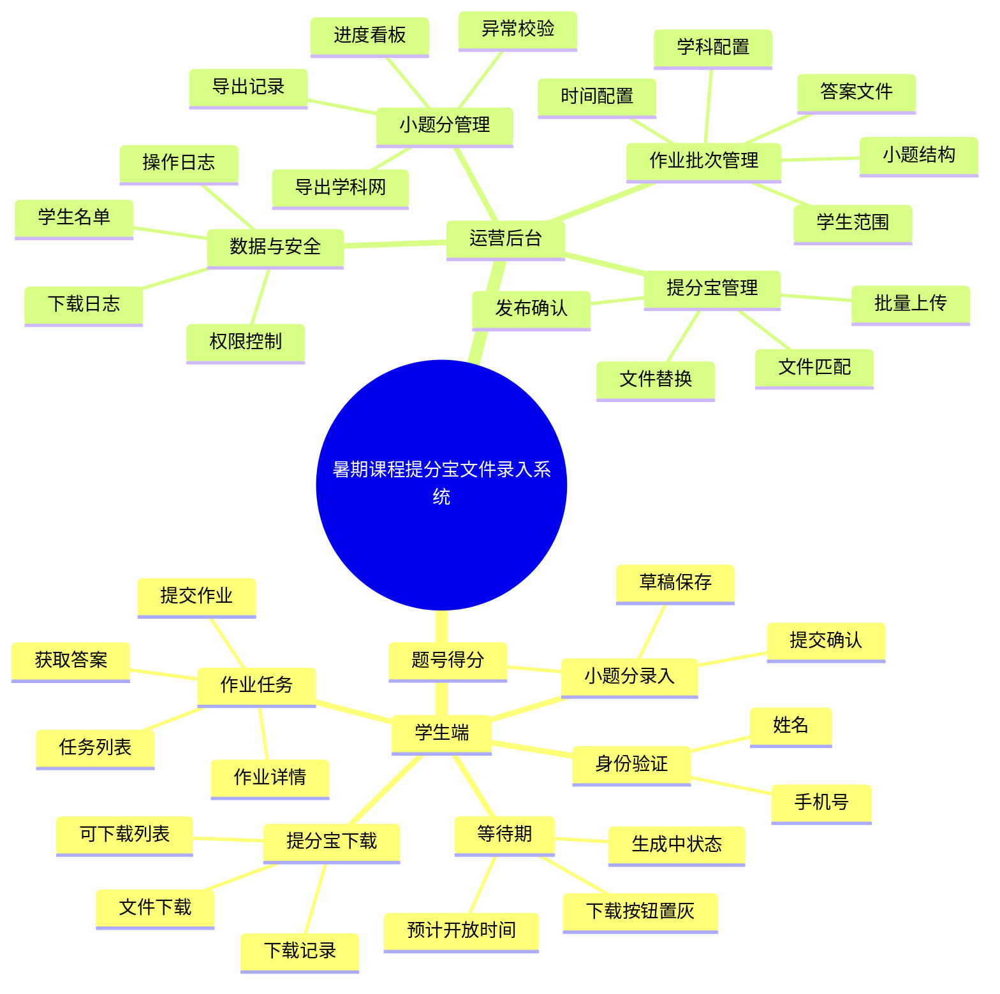
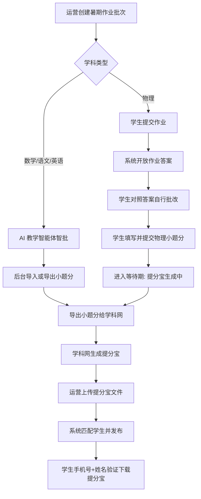
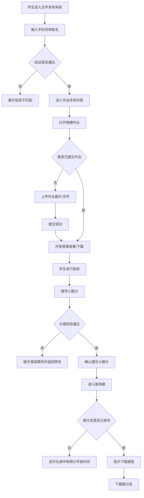
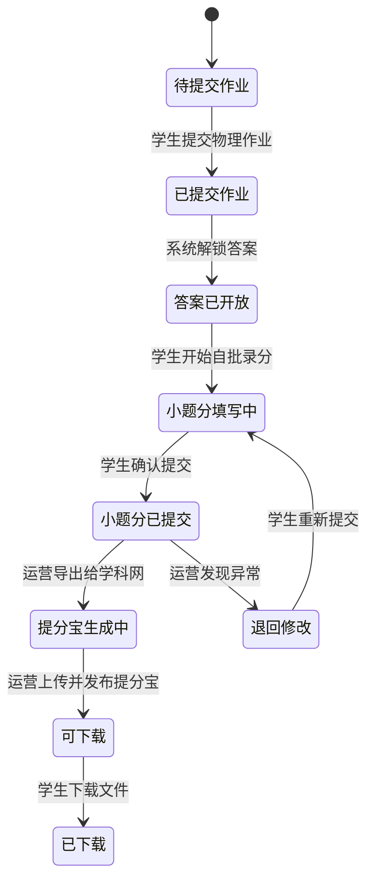

# 暑期课程提分宝文件录入系统 PRD

## 1. 文档信息

| 字段 | 内容 |
| --- | --- |
| 产品名称 | 暑期课程提分宝文件录入系统 |
| 产品形态 | 学生端网页/小程序入口 + 内部运营后台 |
| 文档版本 | V1.0 |
| 编写日期 | 2026-06-17 |
| 核心范围 | 物理作业提交、答案获取、学生自批录分、等待学科网生成提分宝、后台录入提分宝、学生验证下载 |

## 2. 项目背景

### 2.1 业务目标

暑期课程需要将作业批改结果转化为学科网生成的“提分宝”文件，并通过文件发布系统发放给学生。数学、语文、英语可通过 AI 教学智能体智批后导出小题分；物理暂由学生提交作业后获取答案，自行批改并填写小题分，再由运营导出给学科网生成提分宝。

本系统的目标是把“作业提交 → 答案发放 → 小题分收集 → 等待生成 → 提分宝录入 → 学生下载”做成一个可追踪、可发布、可等待、可验证的闭环。

### 2.2 目标用户

| 用户类型 | 用户画像 | 核心诉求 |
| --- | --- | --- |
| 学生/家长 | 参加暑期课程，需要提交物理作业并下载个人提分宝 | 操作简单，知道当前进行到哪一步，等待期间有明确提示 |
| 教务/运营 | 负责发布作业、上传答案、导出小题分、录入提分宝 | 减少人工收集和文件匹配错误 |
| 学科网对接人员 | 接收小题分文件并返回提分宝文件 | 文件格式稳定，数据字段完整 |
| 管理员 | 负责权限、数据、文件安全和异常处理 | 全流程可追踪，可定位学生状态和文件版本 |

### 2.3 核心价值

将物理提分宝生成中的人工等待和文件流转显性化，让学生知道“已提交、生成中、可下载”，让运营知道“谁未提交、谁未录分、谁已生成、谁已下载”。

## 3. 产品架构

### 3.1 功能架构图

### 3.2 用户角色与权限

| 角色 | 主要权限 |
| --- | --- |
| 学生/家长 | 通过手机号+姓名验证；提交作业；获取答案；填写/提交小题分；查看等待状态；下载本人提分宝 |
| 教务运营 | 创建作业批次；上传答案；配置小题结构；查看学生进度；导出小题分；上传和发布提分宝 |
| 管理员 | 管理学生名单、角色权限、文件替换、异常处理和操作日志 |
| 只读查看 | 查看任务进度和下载状态，不可上传、发布或导出 |

## 4. 核心业务流程

### 4.1 总流程

### 4.2 物理学生端流程

### 4.3 等待期状态流

## 5. 关键规则

### 5.1 物理答案开放规则

| 规则 | 说明 |
| --- | --- |
| 提交后开放 | 学生必须先提交物理作业图片或文件，系统才展示答案文件 |
| 同批次唯一 | 一个作业批次对应一份答案文件，可支持多附件 |
| 截止控制 | 超过作业提交截止时间后，是否允许补交由后台配置 |
| 记录留痕 | 每次提交和重新提交都记录时间、文件、操作者 |

### 5.2 小题分录入规则

| 规则 | 说明 |
| --- | --- |
| 题目结构后台配置 | 运营为每个物理作业批次配置题号、满分、是否必填 |
| 得分范围校验 | 学生填写得分必须大于等于 0，且小于等于该题满分 |
| 总分自动计算 | 页面实时汇总总分，并在提交确认页展示 |
| 提交后默认锁定 | 小题分提交后学生不可直接修改，需运营退回 |
| 导出前校验 | 存在未填题、超分、缺少学生信息时不可进入正式导出 |

### 5.3 等待期规则

| 规则 | 说明 |
| --- | --- |
| 等待期开始 | 学生提交小题分后，状态立即变为“提分宝生成中” |
| 等待期展示 | 学生端展示预计开放时间、当前说明和不可下载状态 |
| 下载按钮 | 等待期内按钮置灰，文案为“提分宝生成中” |
| 等待期结束 | 运营上传并发布该学生提分宝后，状态变为“可下载” |
| 延迟处理 | 超过预计开放时间仍未发布时，展示“生成延迟，请等待通知或联系客服” |

### 5.4 提分宝文件匹配规则

| 匹配方式 | 优先级 | 说明 |
| --- | --- | --- |
| 学生编号 | 1 | 如学生名单中有唯一编号，优先使用 |
| 手机号 | 2 | 文件名或导入表包含手机号时可匹配 |
| 姓名+手机号 | 3 | 下载验证也使用该组合，适合首期 |
| 人工匹配 | 4 | 自动匹配失败时，由运营手动选择学生 |

## 6. 页面设计

### 6.1 学生端：身份验证页

| 元素 | 类型 | 说明 | 校验规则 |
| --- | --- | --- | --- |
| 手机号 | 输入框 | 输入报名/课程绑定手机号 | 11 位手机号，必填 |
| 学生姓名 | 输入框 | 输入学生真实姓名 | 必填，去除首尾空格 |
| 验证进入 | 按钮 | 验证通过后进入个人任务列表 | 失败不展示任何他人信息 |

### 6.2 学生端：作业任务列表

| 区域 | 内容 |
| --- | --- |
| 顶部身份 | 展示学生姓名、脱敏手机号 |
| 任务卡片 | 展示学科、作业名称、提交截止时间、当前状态 |
| 状态标签 | 待提交、待录分、生成中、可下载、已下载、已过期 |
| 主按钮 | 根据状态显示“提交作业”“填写小题分”“生成中”“下载提分宝” |

### 6.3 学生端：物理作业详情页

| 区域 | 内容 |
| --- | --- |
| 作业说明 | 作业名称、适用课程、提交要求、截止时间 |
| 作业上传 | 支持图片/PDF 上传，显示已上传文件 |
| 答案区域 | 未提交时隐藏；提交成功后展示答案查看/下载入口 |
| 下一步入口 | 提交后引导“对照答案批改并填写小题分” |

### 6.4 学生端：小题分填写页

| 元素 | 类型 | 说明 |
| --- | --- | --- |
| 题号列表 | 表单 | 按后台题目结构展示每题满分和得分输入 |
| 总分栏 | 固定汇总 | 实时显示已填总分/满分 |
| 保存草稿 | 按钮 | 暂存当前填写内容 |
| 提交小题分 | 按钮 | 校验通过后进入确认弹窗 |
| 确认弹窗 | 弹窗 | 展示总分、空题、0 分题数量，二次确认 |

### 6.5 学生端：等待期/下载页

| 状态 | 页面展示 | 主按钮 |
| --- | --- | --- |
| 小题分已提交 | “已收到你的小题分，正在汇总生成提分宝” | 生成中，置灰 |
| 提分宝生成中 | “预计开放时间：YYYY-MM-DD HH:mm” | 生成中，置灰 |
| 生成延迟 | “生成时间略有延迟，请等待通知或联系客服” | 联系客服 |
| 可下载 | 展示文件名称、生成时间、有效期 | 下载提分宝 |
| 已下载 | 展示最近下载时间，允许再次下载 | 再次下载 |

### 6.6 运营后台：作业批次管理

| 功能 | 说明 |
| --- | --- |
| 新建作业批次 | 配置作业名称、学科、适用学生、提交截止、录分截止、预计开放时间 |
| 上传答案 | 物理批次上传答案文件，设置“提交后开放” |
| 配置小题结构 | 录入题号、满分、必填、小数分规则 |
| 发布任务 | 发布后学生端可见 |
| 查看进度 | 查看提交作业、填写小题分、等待生成、可下载、已下载人数 |

### 6.7 运营后台：小题分与提分宝管理

| 功能 | 说明 |
| --- | --- |
| 小题分列表 | 按学生查看每题得分、总分、提交时间、异常状态 |
| 导出学科网 | 按模板导出小题分文件 |
| 提分宝上传 | 批量上传学科网返回的提分宝文件 |
| 自动匹配 | 按学生编号/手机号/姓名匹配文件归属 |
| 发布确认 | 发布后学生端立即变为可下载 |
| 替换文件 | 单个学生文件错误时可替换，并保留旧版本记录 |

## 7. 数据字段设计

### 7.1 作业批次

| 字段 | 说明 |
| --- | --- |
| batch_id | 作业批次 ID |
| subject | 学科：物理/数学/语文/英语 |
| title | 作业名称 |
| student_scope | 可参与学生范围 |
| homework_deadline | 作业提交截止时间 |
| score_deadline | 小题分提交截止时间 |
| expected_download_time | 提分宝预计开放时间 |
| answer_files | 答案附件 |
| status | 草稿/已发布/已暂停/已结束 |

### 7.2 学生任务状态

| 字段 | 说明 |
| --- | --- |
| student_id | 学生 ID |
| batch_id | 作业批次 ID |
| homework_status | 未提交/已提交/已过期 |
| answer_unlocked | 是否已开放答案 |
| score_status | 未填写/草稿/已提交/退回修改 |
| tifenbao_status | 未生成/生成中/可下载/已下载/已过期 |
| last_download_time | 最近下载时间 |

### 7.3 小题分

| 字段 | 说明 |
| --- | --- |
| score_record_id | 小题分记录 ID |
| student_id | 学生 ID |
| batch_id | 作业批次 ID |
| item_no | 题号 |
| full_score | 满分 |
| student_score | 学生自评得分 |
| submit_time | 提交时间 |

### 7.4 提分宝文件

| 字段 | 说明 |
| --- | --- |
| file_id | 文件 ID |
| student_id | 归属学生 |
| batch_id | 作业批次 |
| file_name | 文件名 |
| file_version | 文件版本 |
| publish_status | 待匹配/待发布/已发布/已替换 |
| publish_time | 发布时间 |
| expire_time | 下载有效期 |

## 8. 异常处理

| 异常场景 | 处理方式 |
| --- | --- |
| 学生手机号+姓名验证失败 | 提示核对报名信息，不展示其他账号线索 |
| 学生未提交作业想看答案 | 提示“提交作业后可查看答案” |
| 学生小题分超出满分 | 标红对应题号，禁止提交 |
| 学生提交后发现填错 | 联系老师/客服，运营后台退回修改 |
| 导出时存在未提交学生 | 可选择仅导出已提交，系统记录导出范围 |
| 学科网返回文件命名不规范 | 进入待匹配列表，由运营手动匹配 |
| 等待期超过预计时间 | 学生端展示延迟提示，后台标记超时批次 |
| 提分宝文件上传错误 | 后台替换文件并记录新版本 |

## 9. 非功能需求

| 类型 | 要求 |
| --- | --- |
| 文件安全 | 答案和提分宝必须通过鉴权接口下载，链接不可永久公开 |
| 数据安全 | 手机号后台默认脱敏展示，导出需权限 |
| 操作留痕 | 发布、导出、上传、替换、退回等动作必须记录操作人和时间 |
| 性能 | 学生任务列表和详情页普通访问响应建议不超过 2 秒 |
| 兼容性 | 支持移动端浏览器/微信内打开，后台支持 PC 浏览器 |
| 可追溯 | 能按学生、作业批次追踪完整状态链路 |

## 10. 迭代规划

| 版本 | 范围 |
| --- | --- |
| MVP | 物理作业提交、答案解锁、小题分填写、等待期、后台导出、提分宝上传发布、学生下载 |
| V1.1 | 短信/服务通知、草稿保存、超时提醒、文件自动命名校验 |
| V1.2 | 接入数学/语文/英语 AI 智批小题分导入，统一进入学科网生成流程 |
| V2.0 | 学科网接口自动对接，减少人工导出和上传 |

## 11. 验收标准

| 场景 | 验收标准 |
| --- | --- |
| 物理学生提交作业 | 学生提交作业后，可立即查看/下载答案 |
| 学生录入小题分 | 系统按题号校验分值，提交后进入生成中 |
| 等待期 | 提分宝未发布前，学生不能下载，页面明确提示生成中和预计开放时间 |
| 后台导出 | 运营可导出学科网所需的小题分文件，并查看导出记录 |
| 提分宝录入 | 运营上传文件后可匹配到学生，发布后学生端状态变为可下载 |
| 学生下载 | 学生用手机号+姓名验证后，只能下载自己的提分宝文件 |

## 12. 待确认问题

| 问题 | 建议默认方案 |
| --- | --- |
| 物理答案是在线查看还是下载文件？ | 首期支持文件下载，兼容图片/PDF 预览 |
| 小题分是否允许半分？ | 按作业批次配置，默认允许 0.5 分 |
| 提分宝预计开放时间如何设定？ | 运营创建作业批次时手动配置 |
| 提分宝是否需要下载有效期？ | 默认有有效期，可后台配置 |
| 学生是否必须上传作业才能录小题分？ | 是，首期要求先提交作业，再开放答案和录分 |
